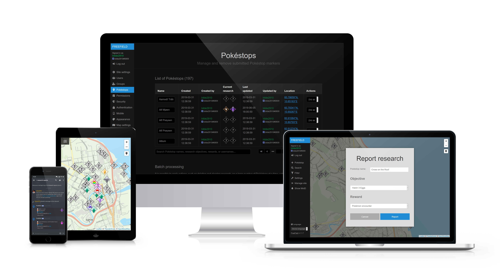

# FreeField

FreeField is a complete self-hosted web solution for members of Pokémon Go
communities to report field research tasks to their community. It is open
source, well-documented and available for download and installation for free.
FreeField has many features, including:

- A mobile-optimized, platform-agnostic, mobile-app-free map
- Automatic reporting to Discord and Telegram
- Per-channel alerts for custom objectives, rewards or geographic areas
- Fine-grained permissions and access controls
- API support and custom integrations for developers

Want to give it a try? Download and extract a [release][releases] to a server
running Apache, PHP and MySQL, browse to the directory index and follow
on-screen installation instructions. Detailed setup instructions, as well as
instructions for nginx and other database backends is available in the [extended
installation instructions][install_docs] in the project documentation.

## Contributors

Neither FreeField, nor its developers, are related to, or affiliated or
associated with, Niantic, The Pokémon Company, or any other companies. FreeField
is a fully independent, community driven project.

### Core developer team

- bilde2910 (project lead)

### Localization

- Marius Lindvall (Norwegian bokmål, Norway)
- Jensen816 (Chinese, Traditional)
- Ayztal (Spanish, Spain)

Do you wish to contribute your own language? Head over to the
[translator documentation][l10n_docs] for more information!

[releases]: https://github.com/bilde2910/FreeField/releases
[install_docs]: https://freefield.readthedocs.io/en/latest/setup.html
[l10n_docs]: https://freefield.readthedocs.io/en/latest/dev/translating.html
