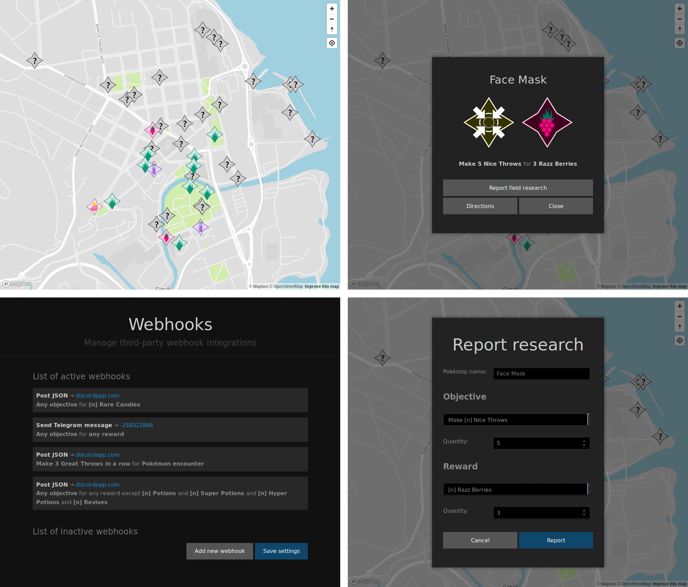

# FreeField

FreeField is a complete self-hosted web solution for members of Pokémon Go
communities to report field research tasks to their community. It is open source
and available for download and installation for free.

Want to try it out? Head over to the [documentation][install_docs] for
information on how to set it up!

Neither FreeField, nor its developers, are related to, or affiliated or
associated with, Niantic, The Pokémon Company, or any other companies. FreeField
is a fully independent, community driven project.

[install_docs]: https://freefield.readthedocs.io/en/latest/setup.html
