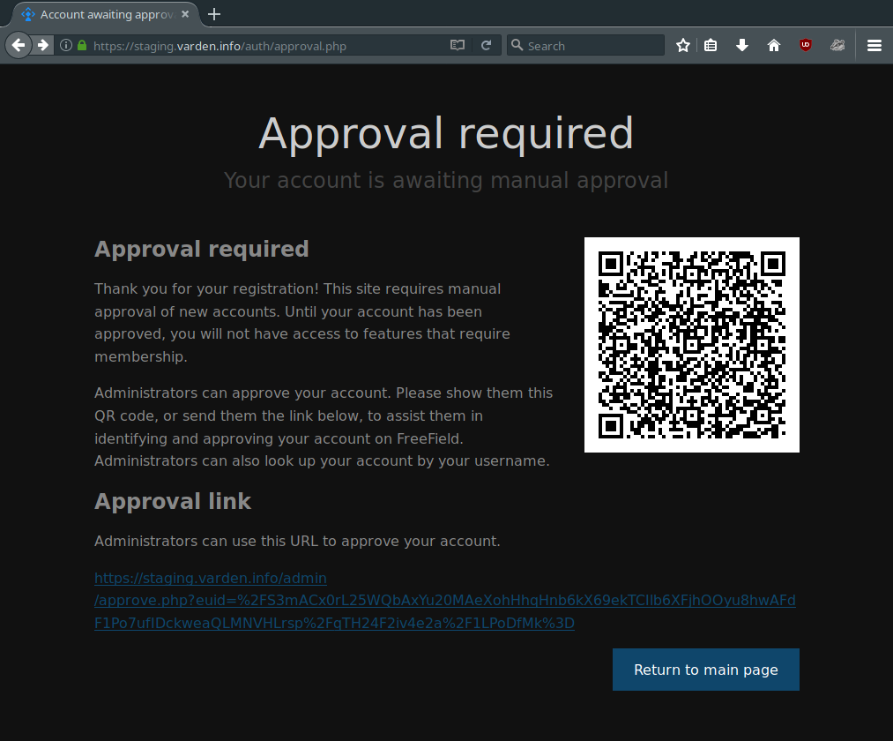
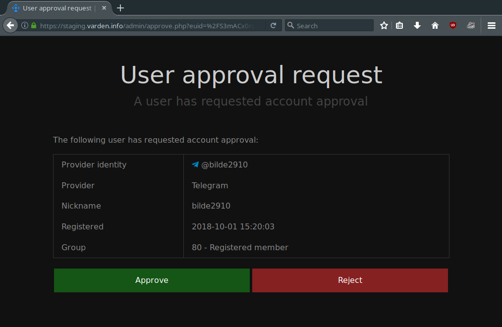

User accounts
=============

FreeField uses third party authentication providers to allow users to sign in.
For information on how to set up different authentication providers, please see
:doc:`/auth/index`. When any user registers on FreeField, the server checks if
the user has logged into that particular FreeField instance previously, and if
not, a new user record is created in the database. You can view and manage all
registered users in the "Users" section of the administration pages.

User account details
--------------------

The "Users" section on the administration pages contains tools needed to manage
the accounts of all users registered on your FreeField instance. The page
contains a table that lists all registered users, with the following fields:

Provider identity
^^^^^^^^^^^^^^^^^

Since users register by signing in with a third party authentication provider,
FreeField will attempt to obtain a human-readable identity representing each
user on the service they are registering through. For example, when signing in
with Discord, FreeField stores the username and discriminator of the user and
uses that to construct a provider identity string for the user (e.g.
ExampleUser#0000). As another example, authentication with Reddit will store the
account name of that user on Reddit (e.g. /u/ExampleUser). The purpose of this
field is to make it easy for you as an administrator to understand who is behind
each account on your instance of FreeField, in case a user misbehaves or
otherwise causes problems on the map or elsewhere in your community. This allows
you to contact the user in question should it be necessary.

Keep in mind that on several provider platforms, the user can change their
provider identity. While each FreeField user will always be internally linked to
the correct user on the user's authentication provider by means of a unique ID
(such as an account number), the human-readable identity displayed in this field
may not necessarily represent the correct user, or even an existing user, if
they changed their provider identity since they last authenticated on FreeField.
Every time a user authenticates (i.e. create a new session by signing in anew),
the provider identity in the FreeField database is updated.

The provider identity will only be updated if the user actually signs in to
FreeField, and you cannot force a user to authenticate. This means that there is
no guaranteed way to ensure that the provider identity stored in the database is
always up to date. While you can take measures that restrict users' access to
FreeField if they do not regularly authenticate, or invalidate their sessions,
you should consider any ethical and privacy implications of doing so.

Provider
^^^^^^^^

This field simply indicates which authentication platform the user has chosen to
sign in on FreeField. If you have only enabled one authentication provider, only
that provider will be listed here, but if you are using several providers, this
field can help you differentiate between accounts that are using the same
username, but on different services.

If you want to disable an authentication provider for whatever reason, it is a
good idea to check the user list and use this field to identify any users who
may currently be using that authentication provider. If you disable a provider,
none of those users will be able to sign in any longer, and would have to resort
to other enabled authentication providers instead.

An existing user signing in on a new authentication provider will count as a new
user registration, and you may have to reconfigure their permissions.

Nickname
^^^^^^^^

Each user on FreeField is automatically assigned a nickname when they register,
which reflects the name or identity of the account the user used to
authenticate. The nickname appears in webhooks when users submit research to
Pokéstops, and is generally considered public information. Users can change
their own nicknames if they have been given the "Change own nickname" permission
(see :doc:`/permissions`). You can also change a user's nickname by editing it
in the relevant box on the "Users" section on the administration pages.

Group
^^^^^

Each user on FreeField is assigned to a group. The group functions as a
permission tier, and changing the group that a user is a member of will result
in that user being granted or revoked permissions on FreeField. The concept of
groups is explained in greater detail on the :doc:`/permissions` page.

Actions
^^^^^^^

The "Users" section on the administration pages allows administrators to perform
various actions on individual registered users, such as deleting their account.
Actions can be performed on several accounts at once through selecting an action
for several users in the list, which will then be applied all at once when
clicking on "Save settings." The available actions for registered users are as
follows:

Delete account
   This action will, if selected, delete the user's account from the FreeField
   users database. Note that it will not delete references to the user in other
   locations, such as the Pokéstops database - if the user has submitted a
   Pokéstop on the map, or was the last person to report research for some
   Pokéstop, then the account ID of the user will still be stored in the
   Pokéstops database, although the list in the Pokéstops section on the
   administration pages will display "<DeletedUser>" rather than the username of
   the deleted user.

   A user whose account has been deleted will still be able to sign up again
   later if they attempt to log in. This will also re-link any references to the
   user in other places, such as in the Pokéstops database.

Log out everywhere
   If you believe that a user has had their accounts compromised, or for some
   other reason want to force a user to sign out, then you can use this action
   to reset their access token in the users database. This will immediately and
   permanently invalidate all of the user's active sessions, forcing them to log
   back in the next time they visit FreeField.

.. _manual-approval:

Manual user approval
--------------------

FreeField has a manual approval setting that allows administrators to require
that all newly registered users are manually approved by an administrator before
they can use their accounts. Until a user's account has been approved, the user
will be given the same permissions as users who are browsing anonymously, i.e.
haven't signed in. To enable manual approval, check the "Require manual
approval" box under "User creation" on the "Security" section of the
administration pages.

When manual user approval is enabled, newly registered users will see a screen
after signing up that looks something like this:

The page will contain a URL that the newly registered user can forward to a site
administrator. When an administrator clicks on the link, they will see a screen
similar to the following:

This way, administrators can easily approve users by link rather than having to
look up the user manually in the user list on the administration pages.

Approval by QR code
^^^^^^^^^^^^^^^^^^^

If you have installed and enabled the ``gd`` extension in php.ini, FreeField
will by default also generate a QR code that can be scanned by an administrator
using a mobile device. This makes it easy to approve users in scenarios where
the administrators wish to meet people in person to approve their accounts. The
QR code will point to the same approval screen as the link, meaning that if
administrators meet the user in person, there is no need for the user to
exchange their link with an administrator on a third party messaging service.

If you wish to enable or disable this functionality, you can check or uncheck
the "Present approval QR codes" box underneath the "Require manual approval"
checkbox.
