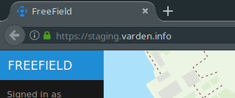
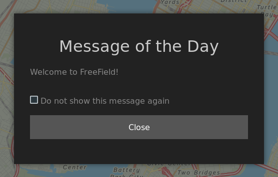
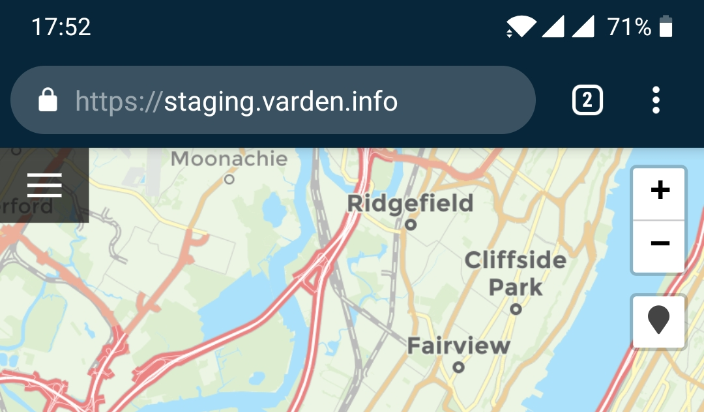

Site appearance
===============

FreeField allows you to customize its visual appearance. This page will explain
the various settings you can use to change FreeField's appearance.

Site name
---------

You can change the site name from the "Site settings" section of the
administration pages. The site name is displayed in the title bar of the browser
on every page in FreeField. You can also change the sidebar header here - this
is the text that appears in the blue field at the top of the sidebar on the map
page, as well as on the administration pages. In the following screenshot, the
site name is set to "FreeField" and the sidebar header set to "FREEFIELD."

.. note:: There are no restrictions on what characters you can use in these
          strings, or on how long they can be. You should, however, pick a
          sidebar header string that is short enough to fit within its box in
          the sidebar.

Message of the Day
------------------

You can set a Message of the Day, or MotD, that is displayed when users visit
the FreeField map. You can configure this message to only display once, or to
display every time a user visits. The MotD can be configured in the "Site
settings" section of the administration pages.

Display mode
   Set how the message should be displayed.

   .. hint:: If the MotD is enabled, users can manually view the message by
             clicking on "Show MotD" in the sidebar on the map page.

Custom message title
   By default, and if this field is left blank, the title of the MotD popup will
   display "Message of the Day." You can override this default by entering a
   custom title here.

Message content
   The message that is displayed in the MotD message popup. Markdown formatting
   is supported.

   .. tip:: A preview of the message will be displayed in the preview box below
            the input field. This allows you to preview the message before you
            save it.

Search indexing
---------------

By default, FreeField will tell search engines such as Google and Bing to not
index your installation. You can change this under the "Crawling" header in the
"Site settings" section of the administration pages.

The setting that changes search indexing behavior is "Robots policy." The
possible values are as follows:

Allow all indexation and crawling (all)
   Allows web spiders to crawl and index your page. If the spiders find links
   on the page, such as in the `Message of the Day`_, they will attempt to
   follow those links and index the target pages as well.

Allow indexation, but do not follow page links (nofollow)
   Like the above setting, web spiders can crawl and index the page, though they
   will no longer attempt to follow links found on the page.

Deny indexation, but allow following page links (noindex)
   Web spiders may look for off-site links on the page that they can follow and
   index, though they will not index FreeField itself.

Deny all indexation and crawling (noindex,nofollow)
   Web spiders and crawlers will not index FreeField, and are additionally told
   not to attempt following and indexing links that are found on the page.

.. note:: This setting only applies to the FreeField index page, i.e. the map
          itself. All pages that require authentication are ``noindex,nofollow``
          regardless of the setting you choose here.

.. note:: Not all web crawlers respect this setting. Non-compliant or malicious
          spiders may still attempt to visit and index your site even if you
          have denied them access using this setting.

Group labels and colors
-----------------------

User groups can be assigned non-default labels and colors that change how they
appear in various places in FreeField. For more information on how to do this,
see :ref:`group-settings`.

PWA theming
-----------

If you use Progressive Web Apps (PWA), you can change the appearance of the PWA
loading screen, icons and names before enabling PWA. Please see :doc:`pwa` for
more information.

Favicon
-------

The favicon is the icon that is displayed in the address bar and in bookmarks
when using FreeField. You can change this icon in the "Appearance" section of
the administration pages.

Favicons should be PNG, GIF or ICO files and should have square dimensions.

Title bar theme color
---------------------

Some mobile browsers (notably Chrome) support changing the color of the address
bar when visiting FreeField. You can change this color in the "Appearance"
section of the administration pages.

The following screenshot shows the "Title bar theme color" set to the default
dark blue background, r=8, g=38, b=58, in Chrome on Android.

UI and map themes
-----------------

You can configure color themes for the user interface, as well as default map
styles, in the "Appearance" section of the administration pages. The following
settings are listed under the "Color theme" header on that section.

Administration interface
   The color theme, dark or light, used on the administration pages. This
   setting affects everyone browsing the administration pages, and cannot be set
   individually.

User settings default
   The color theme, dark or light, used for dialogs and the settings menu on the
   map page. Users can individually override this setting for their own devices
   unless the "Settings personalization" option is disabled.

Settings personalization
   If checked, users are allowed to select a different color theme than the
   default above for their own devices.

Default map provider theme
   The theme that is used for the map itself.

   .. tip:: To see how each theme looks, either refer to the documentation for
            the map provider you are using, or simply test each map theme on the
            user settings for your own account. To do so, ensure that "Map
            personalization" below is enabled, then go to the main map page,
            click on "Settings" in the sidebar, select a different map theme,
            then click :guilabel:`Save settings`, and evaluate the appearance of
            each theme. FreeField comes with defaults that are chosen to be
            easily understood by users, and that work well in daylight
            conditions.

Map personalization
   If checked, users are allowed to choose a different map theme than the
   default above for their own devices.

Map markers
-----------

FreeField comes with one set of map markers by default. If you have several sets
installed, you can choose which one is the default for your users, and whether
or not users are allowed to choose a different set for themselves. This can be
configured under the "Map markers" heading of the "Appearance" section in the
administration pages.

When you select a map marker theme, you will get a preview of all the icons the
icon pack contains.

You can choose to deny users their ability to choose their own icon set. Keep in
mind that users will only be able to choose from the installed icon sets either
way, and cannot upload or use their own custom icons on your site.
