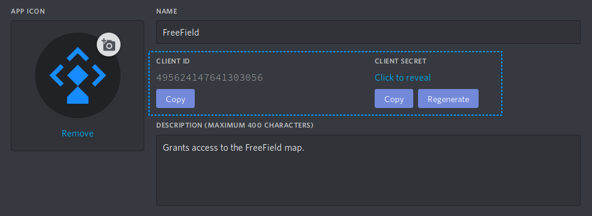
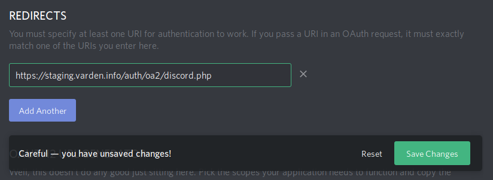
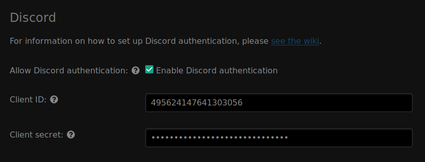
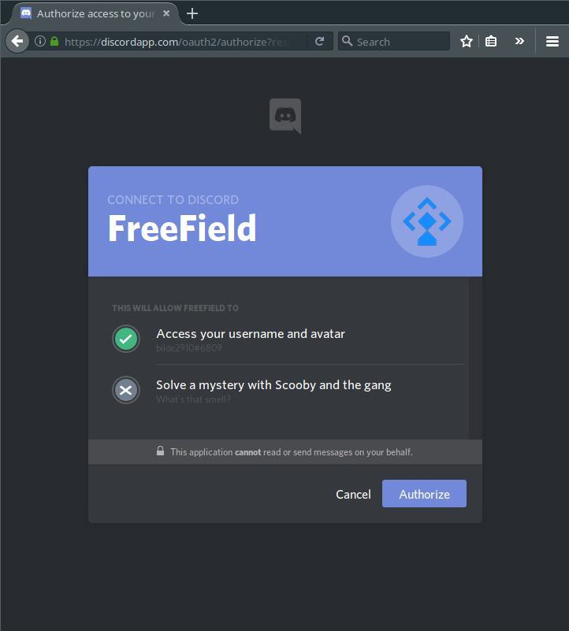

Discord authentication
======================

In order to set up Discord authentication, you need to register an application
on Discord. This can be done from the Discord website.

Registering an application
--------------------------

1. Go to https://discordapp.com/developers/applications/ and log in with your
   Discord account.
2. Click on "Create an application".
3. Give your application a name and description.

   .. tip:: You should choose a name that reflects the community you have set up
            FreeField for. A good idea is to use the name of your community, or
            a location-specific name such as "New York FreeField." You may
            optionally upload an icon for your application, which will be
            displayed when users attempt to authenticate.

4. Take note of the "Client ID" and "Client Secret" assigned to your
   application:

5. On the same page, look for "OAuth2" in the sidebar menu. Click on it to
   navigate to the authentication options.
6. In the "Redirects" section, add a new redirect and paste the redirect URL for
   FreeField's implementation of OAuth2 with Discord. This URL is
   ``auth/oa2/discord.php``, relative to your installation path. E.g. if you
   have installed FreeField to ``https://example.com/freefield/``, the redirect
   URL would be ``https://example.com/freefield/auth/oa2/discord.php``.

7. Ensure that you click the "Save changes" button at the bottom of the page
   (see the above screenshot). It is recommended that you reload the page after
   saving changes to ensure that the redirect URL was added.

Enabling Discord authentication in FreeField
--------------------------------------------

After you have registered an application on Discord, you can configure FreeField
to use Discord for authentication.

1. In the FreeField administration pages, navigate to the "Authentication" menu.
2. In the Discord section, check the box next to "Enable Discord authentication"
   and paste the client ID and secret you got from Discord in the relevant
   fields.

3. Save the setting using "Save settings" at the bottom of the page.

Authentication preview
----------------------

When users authenticate with FreeField through Discord, they will see an
authentication prompt similar to this:

