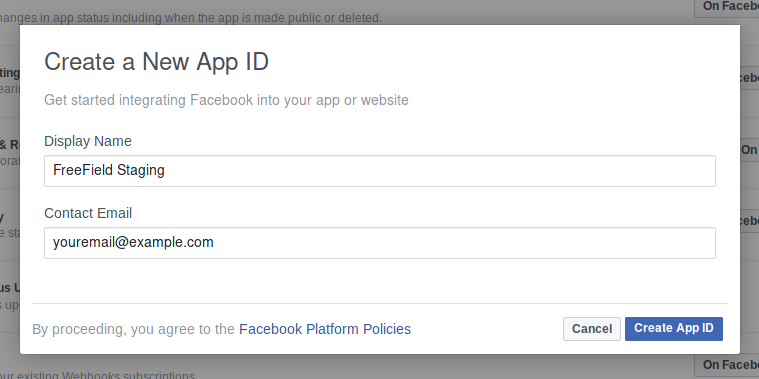
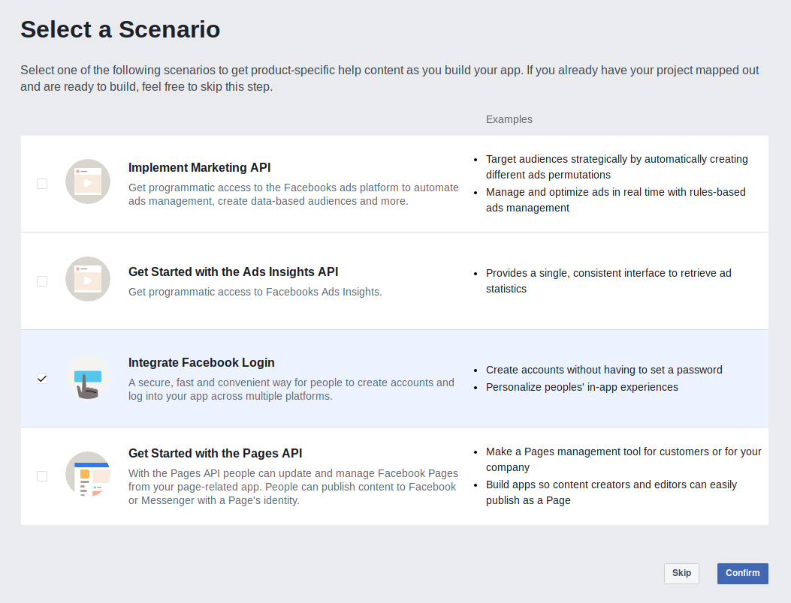
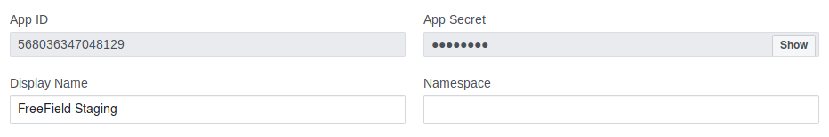
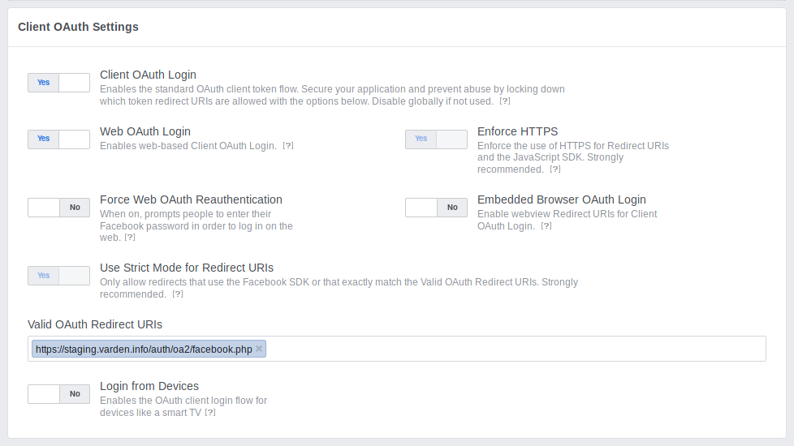
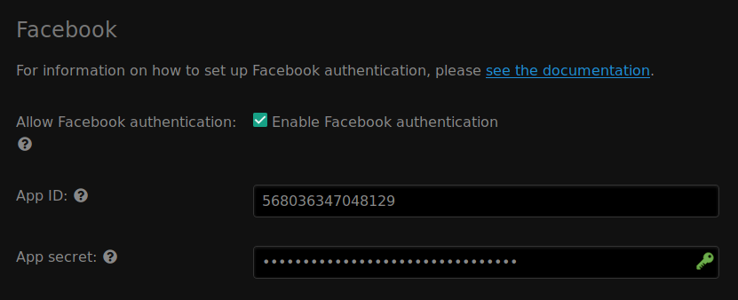
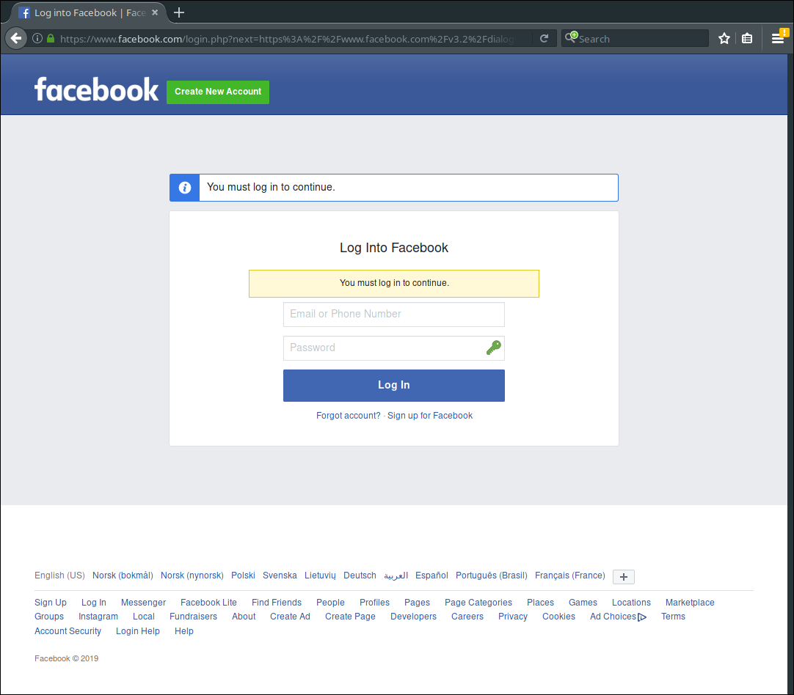

Facebook authentication
=======================

In order to set up Discord authentication, you need to register an application
on Discord. This can be done from the Discord website.

Registering an application
--------------------------

1. Go to https://developers.facebook.com/ and log in with your Facebook account.
2. Under the "My Apps" menu, click "Create New App."
3. Give your application a name and provide your contact email address.

   .. tip:: You should choose a name that reflects the community you have set up
            FreeField for. A good idea is to use the name of your community, or
            a location-specific name such as "New York FreeField." You may
            optionally upload an icon for your application, which will be
            displayed when users attempt to authenticate.

4. Click on :guilabel:`Create App ID`. If you are prompted to provide human
   verification, do so and click :guilabel:`Confirm`.

5. When prompted to select a Scanario, select "Integrate Facebook Login" and
   click :guilabel:`Confirm`.

6. Take note of the "App ID" and "App Secret" assigned to your application:

7. On the same page, look for "Facebook Login" in the sidebar menu. Click on it,
   then click on the "Settings" sub-option to navigate to the authentication
   options.
8. In the "Valid OAuth Redirect URIs" field, paste the redirect URL for
   FreeField's implementation of OAuth2 with Facebook. This URL is
   ``auth/oa2/facebook.php``, relative to your installation path. E.g. if you
   have installed FreeField to ``https://example.com/freefield/``, the redirect
   URL would be ``https://example.com/freefield/auth/oa2/facebook.php``.

   -  If your FreeField installation does not support HTTPS, make sure to
      disable "Enforce HTTPS" on this page as well.

9. Click "Save Changes" to save the settings.

Enabling Facebook authentication in FreeField
---------------------------------------------

After you have registered an application on Facebook, you can configure
FreeField to use Facebook for authentication.

1. In the FreeField administration pages, navigate to the "Authentication" menu.
2. In the Facebook section, check the box next to "Enable Facebook
   authentication" and paste the app ID and secret you got from Facebook in the
   relevant fields.

3. Save the setting using :guilabel:`Save settings` at the bottom of the page.

Authentication preview
----------------------

When users authenticate with FreeField through Facebook, they will see an
authentication prompt similar to this:

