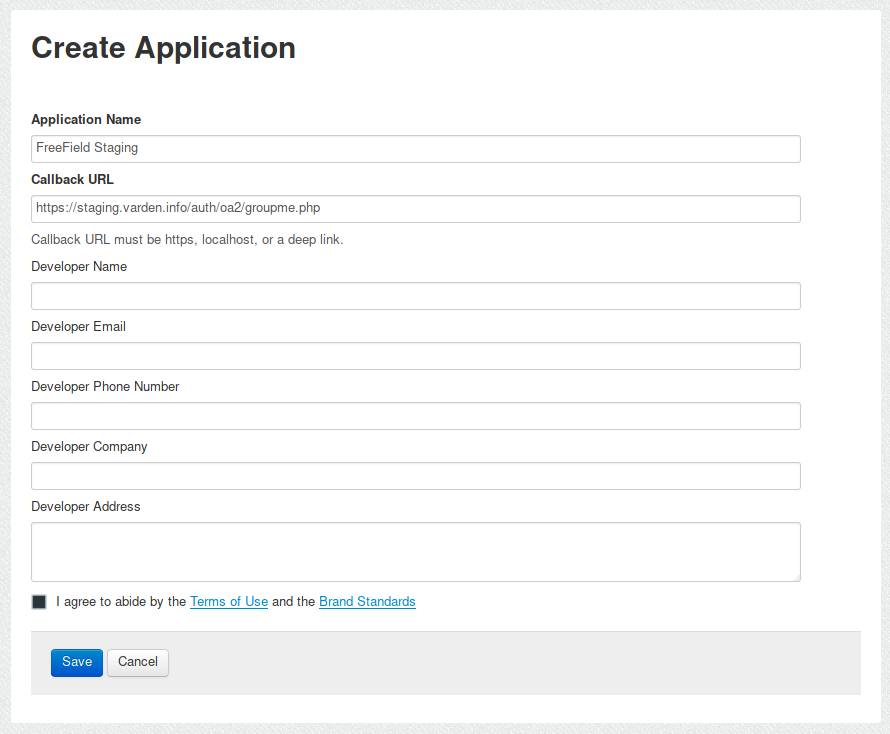
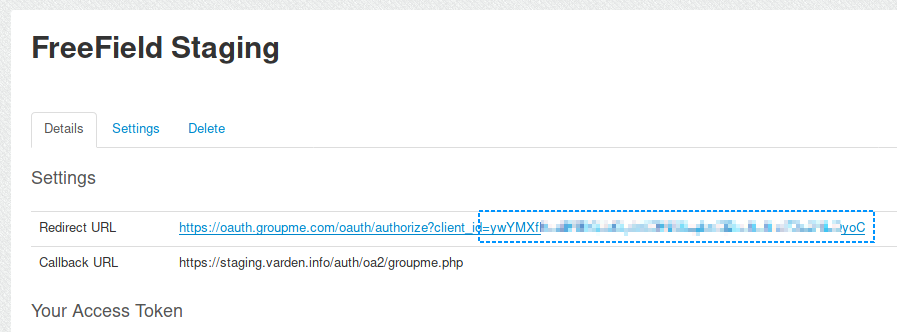
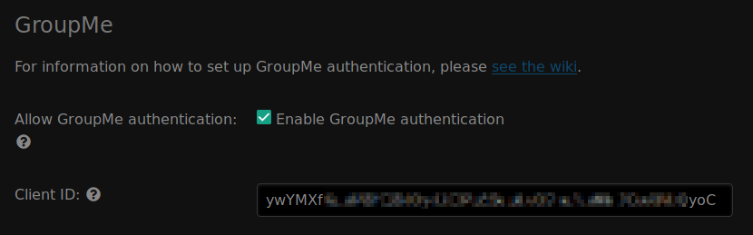

GroupMe authentication
======================

In order to set up GroupMe authentication, you need to register an application
on GroupMe. This can be done from the GroupMe website.

Registering an application
--------------------------

1. Go to https://dev.groupme.com/applications/new and log in with your GroupMe
   account.
2. Give your application a name. You should choose a name that reflects the
   community you have set up FreeField for. A good idea is to use the name of
   your community, or a location-specific name such as "New York FreeField."
3. In the "Callback URL" box, paste the redirect URL for FreeField's
   implementation of OAuth2 with GroupMe. This URL is ``auth/oa2/groupme.php``,
   relative to your installation path. E.g. if you have installed FreeField to
   ``https://example.com/freefield/``, the redirect URL would be
   ``https://example.com/freefield/auth/oa2/groupme.php``.

4. Fill in the rest of the form with your own contact details. Click "Save" when
   you are done.
5. Take note of the client ID assigned to your application. The client ID can be
   found at the end of the redirect URL now displayed on the page.

Enabling GroupMe authentication in FreeField
--------------------------------------------

After you have registered an application on GroupMe, you can configure FreeField
to use GroupMe for authentication.

1. In the FreeField administration pages, navigate to the "Authentication" menu.
2. In the GroupMe section, check the box next to "Enable GroupMe authentication"
   and paste the client ID you got from GroupMe in the relevant field.

3. Save the setting using "Save settings" at the bottom of the page.

Authentication preview
----------------------

When users authenticate with FreeField through GroupMe, they will see an
authentication prompt similar to this:

.. image:: _images/groupme-04-preview.png

When they log in, they will be redirected back to FreeField and be signed in
automatically.
