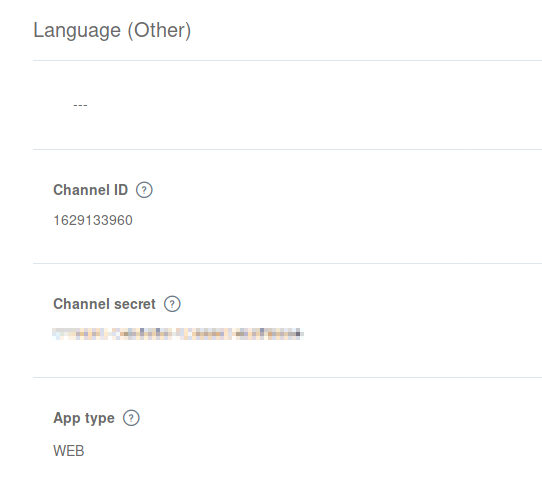
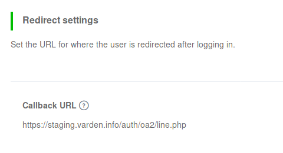
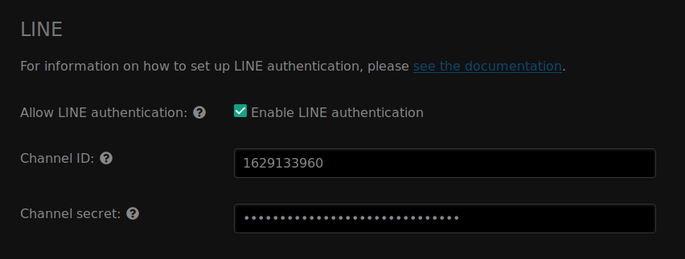
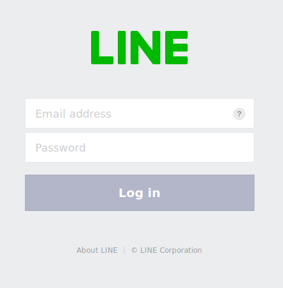

LINE authentication
===================

In order to set up LINE authentication, you need to register an application on
the LINE Developer Console. This can be done from the LINE Developers website.

Registering an application
--------------------------

1. Go to https://developers.line.biz/console/ and log in with your LINE account.
2. Click on :guilabel:`Create new provider`.
3. Enter a provider name (your own name, or that of your organization).
4. Create a new channel under your provider, and select LINE Login as the
   channel type.
5. Give your application a name and description.

   .. tip:: You should choose a name that reflects the community you have set up
            FreeField for. A good idea is to use the name of your community, or
            a location-specific name such as "New York FreeField." You may
            optionally upload an icon for your application, which will be
            displayed when users attempt to authenticate.

6. Select "Use WEB" as the app type. Enter your email address and create the
   channel.
7. In your application's settings, take note of the "Channel ID" and "Channel
   secret" assigned to your application:

8. On the same page, look for and go to the "App settings" tab.
9. Under "Callback URL", click :guilabel:`Edit` and paste the redirect URL for
   FreeField's implementation of OAuth2 with LINE. This URL is
   ``auth/oa2/line.php``, relative to your installation path. E.g. if you have
   installed FreeField to ``https://example.com/freefield/``, the redirect URL
   would be ``https://example.com/freefield/auth/oa2/line.php``.

Enabling LINE authentication in FreeField
--------------------------------------------

After you have registered an application on LINE, you can configure FreeField to
use LINE for authentication.

1. In the FreeField administration pages, navigate to the "Authentication" menu.
2. In the LINE section, check the box next to "Enable LINE authentication" and
   paste the channel ID and secret you got from LINE in the relevant fields.

3. Save the setting using "Save settings" at the bottom of the page.

Authentication preview
----------------------

When users authenticate with FreeField through Discord, they will see an
authentication prompt similar to this:

