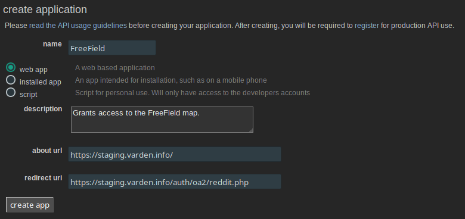
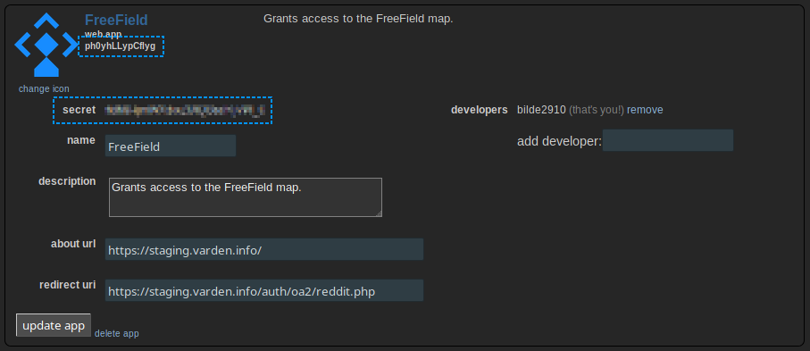
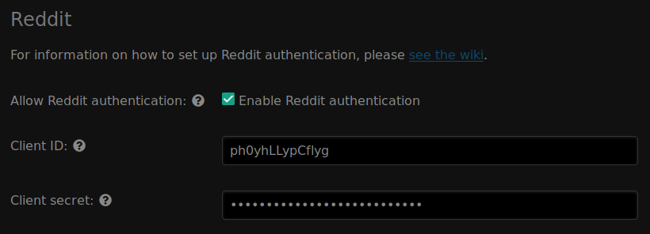
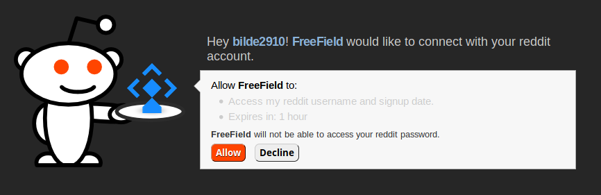

Reddit authentication
=====================

In order to set up Reddit authentication, you need to register an app on Reddit.
This can be done from the Reddit website.

Registering an app
------------------

Please note that Reddit may require you to agree to API usage guidelines before
you create your application. This is detailed on the applications creation page
as well as on the `Reddit wiki <https://www.reddit.com/wiki/api>`_.

1. Log in on Reddit, then go to https://www.reddit.com/prefs/apps.
2. Scroll to the bottom of the page and click on "are you a developer? create an
   app..."
3. Select "web app" as your app type.
4. Give your application a name and description.

   .. tip:: You should choose a name that reflects the community you have set up
            FreeField for. A good idea is to use the name of your community, or
            a location-specific name such as "New York FreeField." You may
            optionally upload an icon for your application, which will be
            displayed when users attempt to authenticate.

5. In the "about url" field, enter the base URL of your FreeField installation,
   e.g. ``https://example.com/freefield/``.
6. In the "redirect uri" field, paste the redirect URL for FreeField's
   implementation of OAuth2 with Reddit. This URL is ``auth/oa2/reddit.php``,
   relative to your installation path. E.g. if you have installed FreeField to
   ``https://example.com/freefield/``, the redirect URL would be
   ``https://example.com/freefield/auth/oa2/reddit.php``.
7. Click on "create app".

8. Take note of the ID and secret assigned to your application.
9. You may optionally upload an icon for your application, which will be
   displayed when users attempt to authenticate.

Enabling Reddit authentication in FreeField
-------------------------------------------

After you have registered an app on Reddit, you can configure FreeField to use
Reddit for authentication.

1. In the FreeField administration pages, navigate to the "Authentication" menu.
2. In the Reddit section, check the box next to "Enable Reddit authentication"
   and paste the client ID and secret you got from Reddit in the relevant
   fields.

3. Save the setting using "Save settings" at the bottom of the page.

Authentication preview
----------------------

When users authenticate with FreeField through Reddit, they will see an
authentication prompt similar to this:

