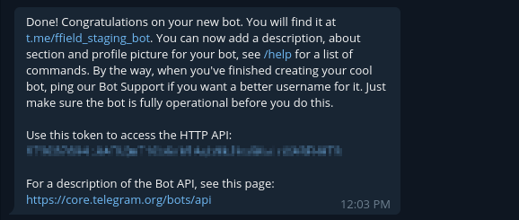
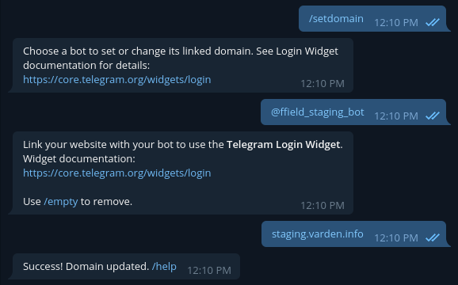
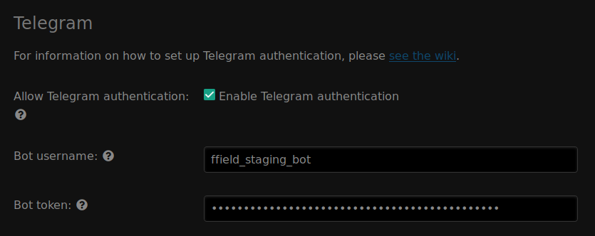
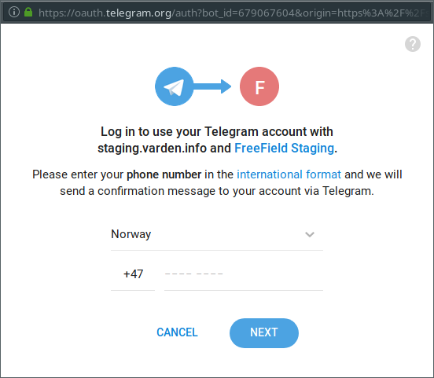
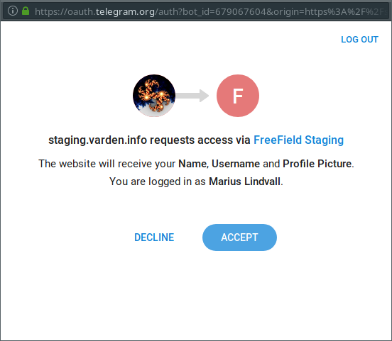

Telegram authentication
=======================

In order to set up Telegram authentication, you need to register a bot on
Telegram. This can be done using @BotFather.

Registering a bot
-----------------

1. Search for the user ``@BotFather`` on Telegram and open a conversation with
   this bot, or `click here <https://t.me/BotFather>`_ to open a conversation
   directly. Click on the "Start" button at the bottom of the Telegram
   interface.

.. image:: _images/telegram-01-botfather.png

2. Issue the ``/newbot`` command in chat.
3. @BotFather will ask for a display name and username of your Telegram bot.
   Enter a display name and username. The display name can be anything, though
   the username must end with "bot".

   .. tip:: You should choose a name that reflects the community you have set up
            FreeField for. A good idea is to use the name of your community, or
            a location-specific name such as "New York FreeField." You may
            optionally upload an icon for your application, which will be
            displayed when users attempt to authenticate.

.. image:: _images/telegram-02-newbot.png

4. You should now be assigned a bot token for your bot by @BotFather. Store this
   token safely.

   .. danger:: Your bot token is very sensitive information. Anyone who obtains
               a copy of this token will be able to impersonate Telegram and
               can authenticate themselves as any Telegram user on FreeField. If
               you or a high level administrator uses Telegram to authenticate
               with FreeField, it is particularly important that this token is
               never, ever shared with anyone else, not even with other
               administrators. In such a case, users who have the bot token
               would be able to succesfully impersonate an administrator and
               either elevate their own privileges to a higher level, or use the
               administrator account directly to disrupt, destroy or even seize
               total, exclusive control over FreeField.

               If you ever suspect that the bot token has been inadvertently
               shared with any other person, **immediately** shut down all
               access to FreeField and revoke and reissue a new bot token
               through @BotFather.

               There is no technical way to fix this attack vector.

5. Issue the ``/setdomain`` command.
6. If you have several Telegram bots, you may be prompted to choose one of them
   to configure the domain for. Select the bot that you just created.
7. Enter the host name of your FreeField site. E.g. if you have installed
   FreeField to ``https://example.com/freefield/``, enter ``example.com``. If
   the domain was updated successfully, you should see the message
   "Success! Domain updated."

Enabling Telegram authentication in FreeField
---------------------------------------------

After you have registered an bot on Telegram, you can configure FreeField to use
Telegram for authentication.

1. In the FreeField administration pages, navigate to the "Authentication" menu.
2. In the Telegram section, check the box next to "Enable Telegram
   authentication" and enter the username you assigned to your bot, as well as
   your assigned bot token, in the relevant fields.

3. Save the setting using "Save settings" at the bottom of the page.

Authentication preview
----------------------

When users authenticate with FreeField through Telegram, they will see an
authentication prompt in Telegram similar to this:

Users would then have to enter the phone number associated with their Telegram
account. After clicking "Next", they will get a notification to approve the
authentication request:

Upon opening the notification, they will be prompted to confirm the sign-in
attempt to their Telegram account:

.. image:: _images/telegram-08-preview-confirm.png

Finally, upon confirmation, they will be prompted to grant FreeField access to
their account:

When they click Accept on this prompt, Telegram will authorize the sign-in
attempt to FreeField so that FreeField can authenticate the user.
