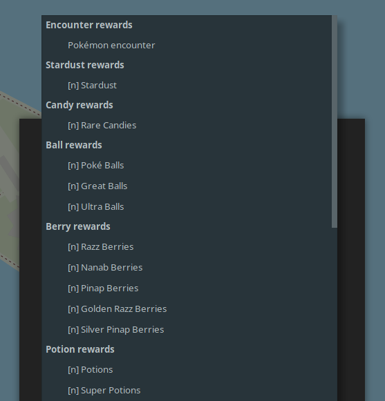

Adding research data
====================

This document will explain the steps behind adding field research data to
FreeField.

Objectives
----------

All available objectives in FreeField are stored in the `objectives.yaml
<https://github.com/bilde2910/FreeField/blob/master/includes/data/objectives.yaml>`_
file. Objectives in this file appear in objective selection menus in the order
they are presented in this file. When adding a new objective, should ensure that
it is grouped with other similar objectives, i.e. don't just throw it at the end
of the file. E.g. ``win_raid`` is placed underneath ``battle_raid``, and
together with ``win_gym`` and ``battle_gym``, because these objectives are
similar in nature.

The structure of a research objective entry is as follows:

.. code-block:: yaml

   objective_id:
       params:
         - param1
         - param2
         - ...
       categories:
         - main_category
         - parent_category
         - ...

Objective IDs
^^^^^^^^^^^^^

Each objective has a unique ID that is used to identify that specific objective
internally. The objective ID should reasonably describe the objective that you
are adding. Feel free to look at existing objective definitions in the file, and
name your objective similarly to those that are already in the file.

For example, "Catch a Pokémon" has the ID ``catch``. "Catch a Pokémon with
Weather Boost" has the ID ``catch_weather``.

All objective IDs are lowercase, with words separated by underscores.

Parameters
^^^^^^^^^^

Many research objectives take one or more parameters. For example,
``catch_type`` ("Catch N X-type Pokémon") takes two - the number of Pokémon to
catch, and the type of Pokémon to catch. These parameters should be listed in
the ``params`` key in the objective's definition. If the objective takes no
parameters, ``params`` is declared as an empty array like this:

.. code-block:: yaml

   objective_id:
       params: []
       categories:
         - main_category
         - parent_category
         - ...

You can only use parameters that have been implemented in FreeField. See `List
of parameters`_ for a list of all parameters you can use.

If you use the ``quantity`` parameter, then that should be the last element in
the parameters list, if multiple elements are present, for internationalization
reasons.

Categories
^^^^^^^^^^

Every objective has one or more assigned categories. Categories are used to
group similar objectives together, and also serve as the declaration of which
icon should be used to represent each objective on the map and elsewhere. Usage
of categories is explained in `Icons and categories`_.

Internationalization
^^^^^^^^^^^^^^^^^^^^

You must internationalize and localize to English any research objectives you
submit to FreeField in the `localization files
<https://github.com/bilde2910/FreeField/tree/master/includes/i18n>`_. These are
located near the top of the files, underneath the species typing localizations.
You must, as a minimum, add the tokens to the en_US.ini file, though if you
speak another language, feel free to add them to the localization files of other
languages you speak.

The tokens you need to add are:

.. code-block:: ini

   objective.<objective_id>.singular = "Perform an action"
   objective.<objective_id>.plural = "Perform {%n} actions"

The two tokens represent the singular and plural versions of the human-readable
string that represents the research objective.

You need to add replacement tags for any parameters required by the objective.
This is done by placing ``{%n}`` tags in the string at the locations that the
parameters are to be substituted in, where :math:`n` is chosen by the order in
which the parameters are declared in the ``params`` field of the objective
definition. For example, consider an objective that has defined its ``params``
array like this:

.. code-block:: yaml

   params:
     - species
     - type
     - quantity

In this case, ``species`` is assigned to ``{%1}``, ``type`` to ``{%2}``, and
``quantity`` to ``{%3}``.

.. note:: Make sure you declare these internationalization tokens in the same
          place as the tokens declared for the other objectives. You can find
          them quickly by searching the file for "objective."

Common objectives
-----------------

In order to make it easy for users to report research, FreeField maintains a
list of research objectives that are commonly reported, along with the specific
Pokémon species those research tasks can award if reported with a Pokémon
encounter reward. These objectives are stored in the `common-tasks.yaml
<https://github.com/bilde2910/FreeField/blob/master/includes/data/common-tasks.yaml>`_
file.

An entry in the file may look like this:

.. code-block:: yaml

   -
       # Power up Pokémon 5 times
       type: "power_up"
       params:
           quantity: 5
       encounter_species:
         - 1 # Bulbasaur
         - 4 # Charmander
         - 7 # Squirtle

Each entry has a ``type``, a list of ``params`` and an optional list of
``enconter_species``.

``type``
   This is the ID of the objective that corresponds to the common task, as
   declared in the objectives.yaml file (see `Objectives`_ above).

``params``
   This is a list of parameters required by the objective specified in ``type``.
   The value corresponds to the value of the parameter in the research
   objective. In the example above, the objective is ``power_up`` i.e. "Power up
   Pokémon [n] times" where :math:`n=5`, assigned to the ``quantity`` parameter,
   which is what is required by the definition of ``power_up``.

``encounter_species``
   This field is optional, though should be present if the research task offers
   Pokémon encounters as a possible reward. If present, this is a list of one or
   more Pokémon species that are awarded upon completion of the research task.

.. note:: The species parameter accepts Pokédex numbers as input. To make it
          easier for readers to understand which species are required or awarded
          by the research task, you should comment the name of the Pokémon
          species after the Pokédex number (as seen in the example above with
          Bulbasaur, Charmander and Squirtle).

Rewards
-------

All available rewards in FreeField are stored in the `rewards.yaml
<https://github.com/bilde2910/FreeField/blob/master/includes/data/rewards.yaml>`_
file. Rewards in this file appear in reward selection menus in the order they
are presented in this file. When adding a new reward, ensure that it is grouped
with other similar rewards, i.e. don't just throw it at the end of the file.
E.g. ``great_ball`` is placed underneath ``poke_ball``, and together with
``ultra_ball``, because these objectives are similar in nature.

Categories of rewards should be ordered such that those rewards that most people
are likely to report are placed at the top of the file. In FreeField, Pokémon
encounters are at the top, while Rare Candies are second, because of their
popularity and desirability for players.

The structure of a research reward entry is as follows:

.. code-block:: yaml

   reward_id:
       params:
         - param1
         - param2
         - ...
       categories:
         - main_category
         - parent_category
         - ...

Reward IDs
^^^^^^^^^^

Each reward has a unique ID that is used to identify that specific reward
internally. The reward ID should reasonably describe the reward that you are
adding. Feel free to look at existing reward definitions in the file, and name
your reward similarly to those that are already in the file.

For example, "Poké Balls" has the ID ``poke_ball``. "Potions" has the ID
``potion``.

All reward IDs are lowercase, singular, and with words separated by underscores.

Parameters
^^^^^^^^^^

Many research rewards take one or more parameters. The majority of rewards offer
some kind of quantity of itself - for example, ``great_ball`` ("Great Balls") -
the number of Great Balls that is awarded by a research task must be specified.
These parameters should be listed in the ``params`` key in the reward's
definition. If the reward takes no parameters, ``params`` is declared as an
empty array like this:

.. code-block:: yaml

   reward_id:
       params: []
       categories:
         - main_category
         - parent_category
         - ...

You can only use parameters that have been implemented in FreeField. See `List
of parameters`_ for a list of all parameters you can use.

If you use the ``quantity`` parameter, then that should be the last element in
the parameters list, if multiple elements are present, for internationalization
reasons.

Categories
^^^^^^^^^^

Every reward has one or more assigned categories. Categories are used to group
similar rewards together, and also serve as the declaration of which icon should
be used to represent each reward on the map and elsewhere. Usage of categories
is explained in `Icons and categories`_.

Internationalization
^^^^^^^^^^^^^^^^^^^^

You must internationalize and localize to English any research rewards you
submit to FreeField in the `localization files
<https://github.com/bilde2910/FreeField/tree/master/includes/i18n>`_. These are
located underneath the objectives localizations and above the category
localizations in the files. You must, as a minimum, add the tokens to the
en_US.ini file, though if you speak another language, feel free to add them to
the localization files of other languages you speak.

The tokens you need to add are:

.. code-block:: ini

   reward.<reward_id>.general = "Item"
   reward.<reward_id>.singular = "1 Item"
   reward.<reward_id>.plural = "{%1} Items"

The two latter tokens represent the singular and plural versions of the
human-readable string that represents the research reward. The former token,
``general``, represents the singular version of the string, but without the
number "1" that denotes quantity of rewards.

You need to add replacement tags for any parameters required by the objective.
This is done by placing ``{%n}`` tags in the string at the locations that the
parameters are to be substituted in, where :math:`n` is chosen by the order in
which the parameters are declared in the ``params`` field of the reward
definition, in the same way they are chosen for objectives. In most cases,
rewards only have the ``quantity`` parameter defined in their ``params`` arrays
like this:

.. code-block:: yaml

   params:
     - quantity

In this case, ``quantity`` is assigned to ``{%1}``.

.. note:: Make sure you declare these internationalization tokens in the same
          place as the tokens declared for the other rewards. You can find them
          quickly by searching the file for "reward."

Research parameters
-------------------

Objectives and rewards are both declared with a list of required parameters.
When an objective or reward definition lists a certain parameter in its
``params`` array, the user will be required to input data for that parameter
when submitting research. Parameters are things such as the quantity of items
rewarded by a task, or a particular species of Pokémon that must be e.g. evolved
in order to complete a particular objective.

FreeField implements parameters using classes that define each parameter's
behavior. This includes how data is read from and displayed to the user, how the
data for a parameter is stored in the database and configuration file, and input
parsing and validation functions for data that is submitted by research
reporters. All of these parameter classes are implemented in the `research.php
<https://github.com/bilde2910/FreeField/blob/master/includes/lib/research.php>`_
file.

Parameters must additionally be registered in the ``PARAMETERS`` constant in
research.php, and internationalization tokens must be created for placeholders
and labels. The sections below will assist you in setting up a class,
registering it, and adding the required internationalization tokens.

Implementing a parameter class
^^^^^^^^^^^^^^^^^^^^^^^^^^^^^^

When you implement a research parameter, it will become available for use as a
requirement by objectives and/or rewards. Classes are placed in the research.php
file. The definition of the ``quantity`` parameter follows below, and will be
used to help you implement your own parameter by way of example.

.. code-block:: php

   /*
       Adds a number box to the field research box prompting the user for the
       quantity of items awarded in a reward/quantity of catches required for
       a catch quest, etc. This parameter is stored as an integer
   */
   class ParamQuantity {
       public function getAvailable() {
           return array("objectives", "rewards");
       }
       public function html($id, $class) {
           return '
<input id="'.$id.'" class="'.$class.'" type="number" min="1">
';
       }
       public function writeJS($id) {
           return 'var val = parseInt($("#'.$id.'").val());
                   if (isNaN(val)) return null;
                   return val;';
       }
       public function parseJS($id) {
           return '$("#'.$id.'").val(data);';
       }
       public function toString($data, $allParams) {
           return strval($data);
       }
       public function toStringJS() {
           return 'return data.toString();';
       }
       public function isValid($data) {
           return is_int($data) && $data >= 1;
       }
   }

The class must implement several required functions. These are explained in
detail below.

``getAvailable()``
""""""""""""""""""

This function must return an array that has either one of, or both, of the
following strings:

"objectives"
   If this string is in the returned array, this parameter will be made
   available as a parameter for research objectives. If not included, this
   parameter will not be possible to use with objectives.

"rewards"
   If this string is in the returned array, this parameter will be made
   available as a parameter for research rewards. If not included, this
   parameter will not be possible to use with rewards.

.. hint:: FreeField separates between objective and reward parameters to cut
          down on the size of the HTML response on the map. If a parameter is
          loaded for both objectives and rewards, it is rendered twice on the
          page - this does not matter much for parameters with a small output
          size, such as ``quantity``, but for parameters with larger output
          sizes, e.g. ``species``, this can have a big effect on the size and
          complexity of the output HTML. Therefore, ensure that you only declare
          the scopes that you actually need the parameter to be valid for - in
          most cases, it only has to be valid for objectives.

``html($id, $class)``
"""""""""""""""""""""

This function must return an HTML string with input boxes that allow the user to
input data for this parameter. For the ``quantity`` parameter, this is just a
simple numerical input box. For ``type``, this input consists of three rows of
select boxes that allow the user to select a Pokémon type.

This function is passed two variables, ``$id`` and ``$class``. You **must** use
these variables as the element ID and class names of your **input box(es)/select
box(es)** (i.e. *not* the parent ``
`` or other tags). If you have multiple
input elements, you can append e.g. "-1", "-2" etc. to the end of the ID. You
can specify additional class names, but the classes provided by ``$class`` must
be present, otherwise the input will not function correctly.

``writeJS($id)``
""""""""""""""""

This function must return a JavaScript function body that fetches the value of
the input elements returned by ``html()`` above and writes/parses it to the
correct data format. The function should return this value, either as a string,
an integer or floating point number, or as an array of any of these. If the
returned value is ``null`` or an empty string, the value will be considered
invalid and the user will not be allowed to submit research until the field has
been populated with data. This can be used to e.g. check if an integer value is
``NaN`` and return ``null`` in that case.

The ``$id`` parameter is the same as the one that is passed to the ``html()``
function, and should be used to find and select the correct input element(s) to
read data from.

The JavaScript function for ``quantity`` looks like this:

.. code-block:: javascript

   var val = parseInt($("#<ID>").val());
   if (isNaN(val)) return null;
   return val;

This function reads the value of the input box with the given ID and attempts to
parse it to an integer. If it fails, it returns ``null`` (i.e. field is empty or
invalid), otherwise it returns the value.

``parseJS($id)``
""""""""""""""""

This function must return a JavaScript function body that does the inverse
operation of ``writeJS()``, i.e. it takes input data, parses it and fills it
into the input boxes with the given ``$id``.

The JavaScript function is passed a parameter ``data`` which contains the data
in the same format as the function in ``writeJS()`` returns. Use this data to
set the value of input boxes in the DOM.

The JavaScript function for ``quantity`` looks like this:

.. code-block:: javascript

   $("#<ID>").val(data);

It simply takes the ``data`` object, which is an integer, and sets it as the
value of the input box with the given ID.

``toString($data, $allParams)``
"""""""""""""""""""""""""""""""

This function should convert the ``$data`` (which is in the format returned by
``writeJS()``) to a human-readable string suitable for substitution into the
localized string before being returned to the user. For example, the objective
"Catch a [Pokémon Species]" (e.g. "Catch a Bulbasaur") uses this function to
return the actual string "Bulbasaur," "Charmander," etc. for substitution into
the "Pokémon species" tag. If you return strings, these **must be localized by
your implementation of this function**. The ``quantity`` parameter only needs to
convert the integer ``$data`` to a string value, hence a simple ``strval()`` is
sufficient. For a more complex example that includes localization, take a look
at e.g. the `implementation for the species parameter
<https://github.com/bilde2910/FreeField/blob/master/includes/lib/research.php#L287-L310>`_.

The ``$allParams`` parameter is an array with all parameters passed to the given
research objective or reward that your parameter is used for. The array can e.g.
look like this:

.. code-block:: php

   $allParams = array(
       "quantity" => 5,
       "species"  => [1, 4, 7]
   );

In most cases, you can ignore this parameter. It can be used to determine
whether the singular or plural form of an internationalized string should be
resolved. This is currently only used in practice in ``encounter_item`` through
its parent class ``ParamReward`` (see `here
<https://github.com/bilde2910/FreeField/blob/master/includes/lib/research.php#L540-L558>`_),
to determine whether the singular or plural form of the name of the required
item should be used, depending on the quantity of items required to use, through
checking the ``quantity`` parameter.

``toStringJS()``
""""""""""""""""

This function should return a JavaScript function body ported from the PHP code
in ``toString()`` above. The function is passed ``data`` and the ``allParams``
object, and should return the same string representation as ``toString()``. This
function is used client-side, while ``toString()`` is used server-side for e.g.
:ref:`tokenref-research-info` in webhook payloads.

``isValid($data)``
""""""""""""""""""

This function should perform server-side input validation on ``$data`` before it
is accepted and stored in the database. There is no guarantee that ``$data`` is
of the same format as the object returned from ``writeJS()``, hence you must
ensure that the format is acceptable as well. The validation function of
``quantity`` checks whether or not the input data is an integer, and also checks
if it is 1 or higher (it makes no sense to report 0 or a negative quantity of an
objective or reward). If you return an array from ``writeJS()``, check that it
is an array with ``is_array()``, and that it has a valid number of elements. If
the output of ``writeJS()`` is a string, check that ``$data`` is a string, etc.

Registering the parameter class
^^^^^^^^^^^^^^^^^^^^^^^^^^^^^^^

In order for a parameter class to be usable, it must be registered in the
``PARAMETERS`` array in the ``Research`` class in research.php. The array may
look like this:

.. code-block:: php

   const PARAMETERS = array(

       // CLass mappings for each parameter
       "quantity" => "ParamQuantity",
       "min_tier" => "ParamMinTier",
       "species" => "ParamSpecies",
       "type" => "ParamType",
       "encounter_item" => "ParamEncounterItem"

   );

Assign your parameter an ID that reflects the kind of data that it holds. For
example, the quantity of items rewarded by a task, or quantity of Pokémon needed
to complete a task, etc. has been assigned the ID ``quantity``. The parameter
that stores the type of Pokémon that must be caught/evolved/etc. for a task is
called ``type``. The name you choose must be in snake_case and is the **key** of
your parameter in the ``PARAMETERS`` array.

The **value** of this key is the name of the class you implemented above. The
class name should, for consistency, begin with "Param," and be followed by the
ID of the parameter converted to UpperCamelCase. For example, ``min_tier``
becomes ``ParamMinTier``.

Adding internationalization tokens
^^^^^^^^^^^^^^^^^^^^^^^^^^^^^^^^^^

You need to define two internationalization tokens in the `localization files
<https://github.com/bilde2910/FreeField/tree/master/includes/i18n>`_ for your
parameter. These are located above the Pokémon species names list, and
underneath the objectives, rewards and categories in the files. You must, as a
minimum, add the tokens to the en_US.ini file, though if you speak another
language, feel free to add them to the localization files of other languages you
speak.

The tokens are:

.. code-block:: ini

   parameter.<parameter_id>.label = "Label of parameter"
   parameter.<parameter_id>.placeholder = "[Placeholder]"

The ``label`` sub-key should contain a short human-readable label that describes
the parameter. E.g. for ``quantity``, this is simply "Quantity." This is the
string that appears next to the input boxes when users report research with the
parameter.

The ``placeholder`` sub-key is displayed in the list of research objectives
and/or rewards for objectives/rewards which implement the parameter, but for
which no value is currently known. E.g. for ``quantity``, the placeholder is
"[n]." This means that the parameter could be displayed as e.g. "Catch [n]
Pokémon" if no quantity is currently known for that task.

.. note:: Make sure you declare these internationalization tokens in the same
          place as the tokens declared for the other parameters. You can find
          them quickly by searching the file for "parameter."

.. _parameter-list:

List of parameters
^^^^^^^^^^^^^^^^^^

The following is a list of all available parameters. When you add a new
parameter type, please document it here.

``quantity``
""""""""""""

Quantity of items rewarded by a task, quantity of Pokémon to catch to complete
an objective, etc. Can be used for both objectives and rewards.

The data of this parameter are stored as **integers** that are 1 or greater.

``min_tier``
""""""""""""

Minimum tier of a raid that must be completed (used in "Win a level [x] or
higher raid"). Can only be used for objectives.

The data of this parameter are stored as **integers** that are in the range 1
through 5.

``species``
"""""""""""

One or more species of Pokémon that must be caught, evolved, etc. up to three
different species. Can only be used for objectives.

The data of this parameter are stored as **arrays of integers** that are at
least one, and up to three elements long. Each element is in the range 1 through
the Pokédex number of the last Pokémon in the latest generation of Pokémon that
are currently implemented in FreeField. The numbers correspond to the Pokédex
number of Pokémon.

``type``
""""""""

One or more types of Pokémon that  must be caught, evolved, etc. up to three
different types. Can only be used for objectives.

The data of this parameter are stored as **arrays of strings** that are at least
one, and up to three elements long. The elements are picked from ``TYPES``:

.. code-block:: php

   const TYPES = array(
       "normal",   "fighting", "flying",
       "poison",   "ground",   "rock",
       "bug",      "ghost",    "steel",
       "fire",     "water",    "grass",
       "electric", "psychic",  "ice",
       "dragon",   "dark",     "fairy"
   );

``encounter_item``
""""""""""""""""""

An item that can be used on the Pokémon encounter screen (i.e. balls and
berries). This is used for the "Use a [Item] while catching Pokémon" objective.
Can only be used for objectives.

The data of this parameter are stored as **strings**, selected from the set of
all rewards that are assigned to the categories "ball" or "berry" in the
`rewards.yaml
<https://github.com/bilde2910/FreeField/blob/master/includes/data/rewards.yaml>`_
file.

Icons and categories
--------------------

Objectives and rewards are both assigned to one or more categories together with
other similar objectives or rewards. Elements that are categorized appear
together in the list of reportable objectives and rewards:

Categories are defined using the ``categories`` field in objective and reward
definitions:

.. code-block:: yaml

   # Great Balls
   great_ball:
       params:
         - quantity
       categories:
         - ball

If several categories are specified, only the category listed at the top will be
used to group the objectives/rewards in the selection menus.

Categories are also used to determine the icon that is displayed on the map for
research that is reported with a specific objective or reward. FreeField will
look for an icon matching the top-most category in the icon set's pack.ini file,
and continue down the list looking for the first one that is present in pack.ini
if the top-most icon is not found. If no icons are found, FreeField falls back
to the ``default`` icon. If there is an entry in pack.ini specifically matching
the ID of the objective or reward, that icon will be used regardless of the
categories in the definition. For more information on how icons work, please
refer to the documentation on creating icon sets.

This is the definition for the ``win_raid`` objective:

.. code-block:: yaml

   # Win a raid
   win_raid:
       params:
         - quantity
       categories:
         - raid
         - battle

When FreeField attempts to load an icon for this objective, it will try the
following icons in order until a matching entry in the pack.ini of the selected
icon set is found:

-  ``win_raid``
-  ``raid``
-  ``battle``
-  ``default``

Adding a new category
^^^^^^^^^^^^^^^^^^^^^

You can declare a new category simply by using it in the definition of an
objective or reward. When declaring a new category, ensure that you follow the
snake_case naming convention of IDs in the data files.

You must declare an internationalization token in the `localization files
<https://github.com/bilde2910/FreeField/tree/master/includes/i18n>`_ and at a
minimum, localize it to English if you add a new category. Category tokens are
located above the parameter tokens, and underneath the objectives and rewards in
the files. If you speak other languages than English, feel free to localize the
tokens to the other languages as well. The token is one of the following:

.. code-block:: ini

   ; For objectives:
   category.objective.<category_id> = "Amazing objectives"

   ; For rewards:
   category.reward.<category_id> = "Amazing rewards"

The token contains the header that is displayed for the category in the
objective/reward selection boxes. You must declare this token even if you do not
intend to use the category as a top-level category. Use either the "objective"
or "reward" token, depending on whether you are applying the category to
objectives or rewards.

.. note:: Make sure you declare these internationalization tokens in the same
          place as the tokens declared for the other categories. You can find
          them quickly by searching the file for "category."
