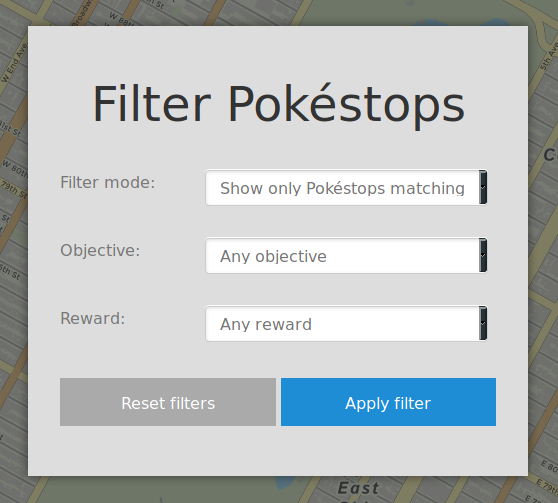

Filtering Pokéstops
===================

If there are many Pokéstops visible on the map at the same time, it can be
challenging to find a specific research task from all of the available tasks. To
help with this, it is possible to filter the map so only Pokéstops with a
certain type of research are available.

1. Click on "Filter" in the sidebar to open the Pokéstop filtering dialog:

2. Next to "Filter mode," select how you wish to filter Pokéstops.
3. Next to "Objective," specify the objective type you wish to filter. For
   example, if you wish to show only Pokéstops with the "Make 5 Great Curveball
   Throws in a row" objective, select "Make [n] Great Curveball Throws in a
   row."

   .. note:: Selecting an objective type will show all Pokéstops that match the
             selection. In the example above, this means that in addition to the
             "Make 5 Great Curveball Throws in a row" objective, Pokéstops with
             e.g. "Make 3 Great Curveball Throws in a row" will also be
             displayed.

4. Next to "Reward," specify the reward type for the research task.

   .. tip:: If you want to show a particular type of reward without care for the
            objective on the Pokéstop, you can choose "Any objective" from the
            Objective menu in the dialog. Combining this with e.g. "Rare candy"
            from the Rewards menu will show all Pokéstops that reward rare
            candies, regardless of the objective of the research task. This also
            works vice versa for objectives.

5. Click on :guilabel:`Apply filter`.

To reset the filters and show all Pokéstops, click on "Filters" in the sidebar
to open the dialog window, then :guilabel:`Reset filters`.

.. tip:: When filters are active, an additional filter icon will be visible
         underneath the sidebar hamburger menu (mobile only), and the "Filters"
         menu item will be highlighted in orange, to indicate that filters are
         active and that some Pokéstops are hidden as a result. You can click
         this filter icon to open the filters dialog directly without having to
         open the sidebar.

.. note:: Pokéstops that are hidden because of filters do not count against the
          hidden Pokéstops counter at the top of the page if clustering is in
          effect.
