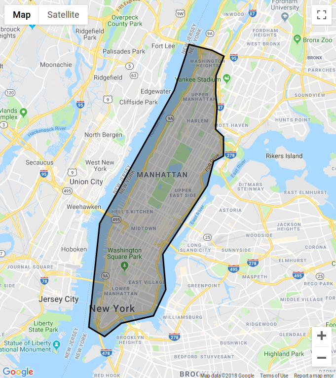
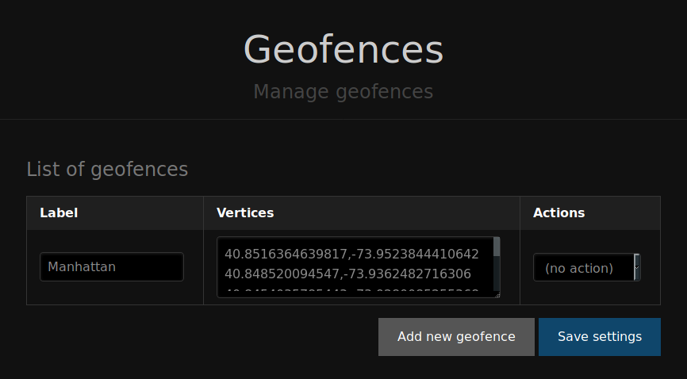
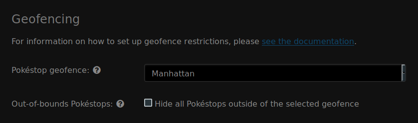

Geofencing
==========

FreeField supports restricting the geographical scope and coverage of various
functionality through geofencing.

.. note:: If you have just set up FreeField, it is highly recommended that you
          set up a geofence that defines the boundary of the region you are
          covering with FreeField, to prevent users from submitting Pokéstops to
          the map in areas that are not supposed to be covered by your map. To
          do this, please follow the steps in `Defining a boundary`_ below to
          create a geofence that covers your entire community area, then follow
          the instructions in `Limiting Pokéstop submission`_ to apply the fence
          to FreeField and restrict usage of FreeField to the area within the
          defined geofence.

A geofence is a list of three or more coordinate pairs that together make up a
polygon covering a certain geographical area. Geofences can be set up on the
"Geofences" section on the administration pages. This documentation entry will
guide you through creating and installing a geofence in FreeField, and then
using it to restrict the map to only being used in certain regions.

Defining a boundary
-------------------

The easiest way to define a boundary for a geofence is to use an online geofence
editor. Here are links to a couple:

- http://geo.jasparke.net/
- https://codepen.io/bgus/full/dXxLjp

Draw an area on the geofence editor that corresponds to the area that you wish
to cover with FreeField:

Once you have drawn the geofence, export the geofence to a list of coordinate
pairs. In FreeField, navigate to the "Geofences" section of the administration
pages. Click on :guilabel:`Add new geofence`, enter a name for your geofence to
easily identify the area it covers, and paste the coordinate pair list in the
text box in the "Vertices" column.

Finally, click :guilabel:`Save settings`. Your geofence is now saved and ready
to be used elsewhere.

Limiting Pokéstop submission
----------------------------

A crucial step in securing your FreeField installation is restricting it to only
be usable within the bounding area that your community covers. To do so, first
define and install a geofence as defined in `Defining a boundary`_ that covers
the entire area you wish to support FreeField for.

After you have defined a geofence, navigate to the "Map settings" section of the
administration pages. Scroll down until you find the "Geofencing" header. In the
"Pokéstop geofence" box, select the geofence you just defined, and click on
:guilabel:`Save settings`.

.. tip:: There is a setting that allows you to hide all Pokéstops outside of the
         selected geofence boundary. This is useful if you previously allowed
         Pokéstop submission outside the current boundary - all of those
         Pokéstops will be hidden, and can research can no longer be submitted
         on them while the geofence is in effect and while this setting is
         active.

.. warning:: If you delete the geofence that is used to limit Pokéstop
             submission, the setting will revert to the default setting (no
             geofences applied), again allowing Pokéstop submissions globally.
             Make sure to define a new geofence and to update this setting again
             if you ever delete this geofence.

Applying geofences to webhooks
------------------------------

Geofences can easily be applied to webhooks. Each webhook has an option labeled
"Geofence" where you can select any geofence defined as described on this page.
When you apply a geofence to a webhook, the webhook will only be triggered if
the Pokéstop that the field research is reported on is within the bounds of the
selected geofence.
