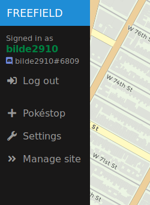
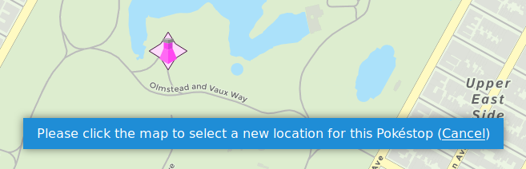
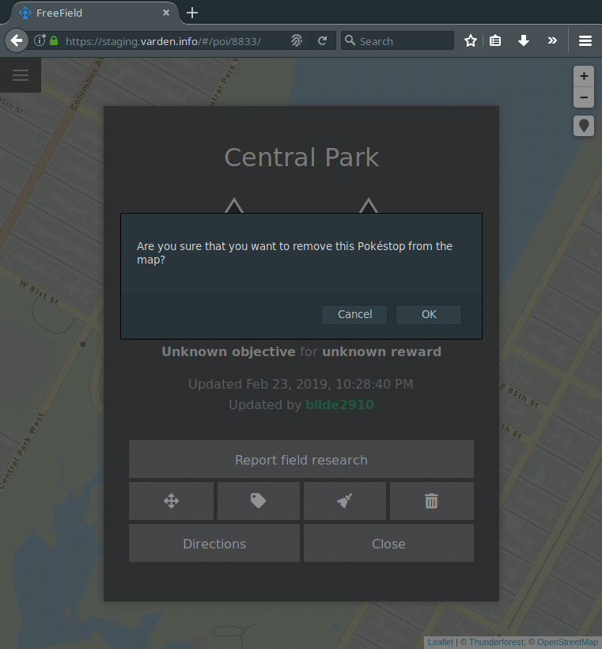
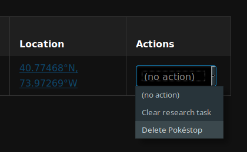
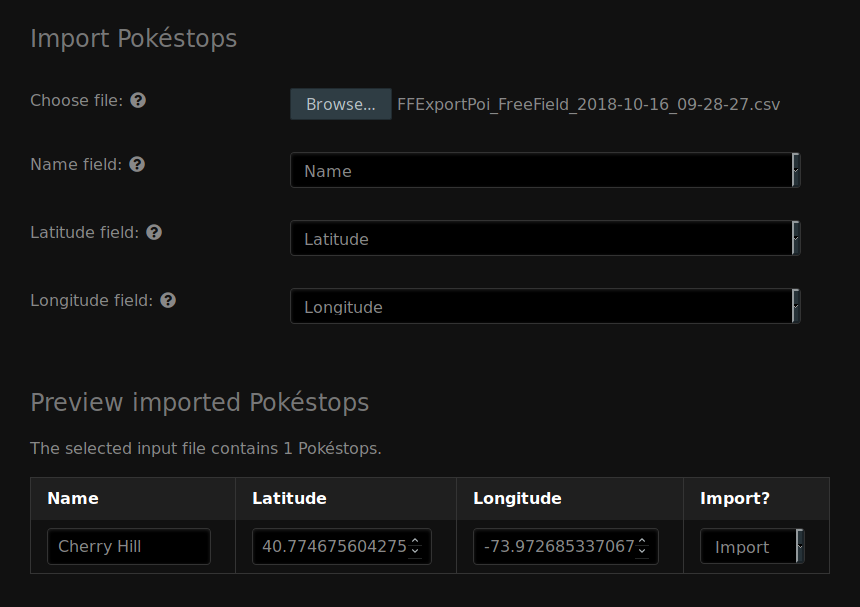

Pokéstops
=========

For FreeField to function according to its intended purpose, a list of Pokéstop
locations need to be added to the map. This page will describe the processes of
adding and managing Pokéstops.

.. note:: This page only covers administrative management of Pokéstops. For
          information on submitting research, please see
          :doc:`/reporting-research`.

Adding a new Pokéstop
---------------------

Any user who has the "Submit Pokéstops" permission (by default, the Pokéstop
submitter group and above) can submit Pokéstops directly from the map view.

1. On the main page of FreeField, click on :guilabel:`+ Pokéstop` in the sidebar
   menu.

2. Click on the map at the position that the Pokéstop should be located.
3. A popup will appear, prompting you for the name of the Pokéstop. Write a name, then
   click on :guilabel:`Add Pokéstop`.

Moving a Pokéstop
-----------------

If a Pokéstop is wrongly located, you can move it to another location directly
from the map view. This requires the "Manage Pokéstops" permission.

1. Click on the Pokéstop on the map that is wrongly located.
2. Click the "Move" button (indicated by a four arrows icon).
3. Click on the map at the location that the Pokéstop should be moved to.

Removing Pokéstops
------------------

Pokéstops can be removed in two ways - through the administration pages, or
directly from the map view.

Removing from the map view
^^^^^^^^^^^^^^^^^^^^^^^^^^

1. Click on the Pokéstop on the map that should be removed.
2. Click the "Delete" button (indicated by a trash bin icon).
3. In the popup that appears, click :guilabel:`OK` to confirm removal of the
   Pokéstop.

Removing from the administration pages
^^^^^^^^^^^^^^^^^^^^^^^^^^^^^^^^^^^^^^

1. Navigate to the "Pokéstops" section on the administration pages.
2. In the list of Pokéstops, look for the Pokéstop(s) that you want to remove.
3. In the "Actions" column for the Pokéstop(s), select "Delete Pokéstop."
4. Click on :guilabel:`Save settings` at the bottom of the page.

Clearing field research
-----------------------

To clear the currently active field research on a Pokéstop and reset it to the
"unknown" research task, do either of the following:

Clearing from the map view
^^^^^^^^^^^^^^^^^^^^^^^^^^

1. Click on the Pokéstop on the map that you want to clear the research task
   for.
2. Click the "Clear research" button (indicated by a brush icon).
3. In the popup that appears, click :guilabel:`OK` to confirm that you wish to
   clear the currently active research from the Pokéstop.

Clearing from the administration pages
^^^^^^^^^^^^^^^^^^^^^^^^^^^^^^^^^^^^^^

1. Navigate to the "Pokéstops" section on the administration pages.
2. In the list of Pokéstops, look for the Pokéstop(s) whose active research task
   you want to clear.
3. In the "Actions" column for the Pokéstop(s), select "Clear research task."
4. Click on :guilabel:`Save settings` at the bottom of the page.

Renaming Pokéstops
------------------

You can rename a Pokéstop either from the map or from the administration pages:

Renaming from the map view
^^^^^^^^^^^^^^^^^^^^^^^^^^

1. Click on the Pokéstop on the map that you want to rename.
2. Click the "Rename" button (indicated by a tag icon).
3. In the popup that appears, enter a new name for the Pokéstop and click
   :guilabel:`OK` to submit the name change.

Renaming from the administration pages
^^^^^^^^^^^^^^^^^^^^^^^^^^^^^^^^^^^^^^

1. Navigate to the "Pokéstops" section on the administration pages.
2. In the list of Pokéstops, look for the Pokéstop(s) you want to rename.
3. In the "Name" column for the Pokéstop(s), enter the new name for the
   Pokéstop(s).
4. Click on :guilabel:`Save settings` at the bottom of the page.

Managing Pokéstops
------------------

FreeField has several functions for managing submitted Pokéstops. You can, for
example, change the name of Pokéstops, see who submitted each Pokéstop, and
perform actions on several Pokéstops at a time. You can find the Pokéstop
management interface in the "Pokéstops" section of the administration, where
every Pokéstop in the FreeField database will be listed. The table contains the
following fields:

Name
   The name of the Pokéstop. You can change the name to something else here.
   Names are not unique; several Pokéstops can have the same names without
   causing conflicts with each other.

Created
   Shows the date and time at which the Pokéstop was added to the Pokéstops
   database in FreeField.

Created by
   Shows the nickname and identity of the user who submitted the Pokéstop to
   FreeField.

Current research
   Shows a brief summary of the currently active research task on this Pokéstop.
   The icons in this field can be clicked to open the details dialog popup for
   the Pokéstop on the FreeField map, where new research can be reported.

Last updated
   Shows the last time an update was made to a Pokéstop. Updates include
   research submission, clearing its currently active research, as well as
   moving the Pokéstop to another location.

Updated by
   Shows the nickname and identity of the user who made the aforementioned
   update to the Pokéstop.

Location
   Shows the coordinates of each Pokéstop. This field is a link that can be
   clicked to pan the FreeField map to the location of the Pokéstop.

Actions
   Allows performing actions on the given Pokéstop, such as deleting it, or
   clearing its field research.

Batch processing
^^^^^^^^^^^^^^^^

It is possible to clear research from, and delete, Pokéstops in batches. This is
done under the "Batch processing" heading of the "Pokéstops" section of the
administration pages.

Batch processing is performed using geofences. When you perform an action on a
geofence, the action affects all Pokéstops within that area. Please see
:doc:`/geofencing` for information on setting up geofences.

.. caution:: Geofences do not function as masks. If you have one geofence within
             another, and you perform an action on the larger geofence while
             keeping the smaller one at "no action," the action will still
             affect Pokéstops in the smaller area, given that those Pokéstops
             are also within the bounds of the larger geofence.

Exporting and importing Pokéstops
---------------------------------

You may export the list of Pokéstops stored in FreeField. The exported file can
be used to re-import Pokéstops later in another FreeField instance. It serves as
an easy way to take a backup of the database.

Exporting Pokéstops
^^^^^^^^^^^^^^^^^^^

To export all of your Pokéstops, go to the "Pokéstops" section of the
administration pages, scroll to the bottom of the page, and look for the "Export
Pokéstops" header. Click on the link labeled "Click here to export the Pokéstop
database." All of the Pokéstops in the database will be downloaded to your
computer in CSV format.

Importing Pokéstops
^^^^^^^^^^^^^^^^^^^

You can import a previously exported list of Pokéstops back into FreeField.

1. Navigate to the "Pokéstops" section of the administration pages and scroll
   down to the "Import Pokéstops" section.
2. Next to "Choose file," browse for the file that contains the Pokéstop
   database export CSV file.
3. In the "Name," "Latitude" and "Longitude" fields, select the column of the
   CSV file that contains the names, latitudes and longitudes of the Pokéstops,
   respectively.
4. The table below the above mentioned fields will be populated with the
   Pokéstops from the CSV export you selected. Make sure to check that all
   fields in the table are correct, and to fill in missing entries (if any).
   Missing fields are highlighted in red. If you do not wish to import a
   specific Pokéstop in the table, you can select "Don't import" in the
   "Import?" column of the table for the Pokéstops you wish to ignore.
5. Click on :guilabel:`Save settings` at the bottom of the page to import all
   listed Pokéstops that are marked for import.

