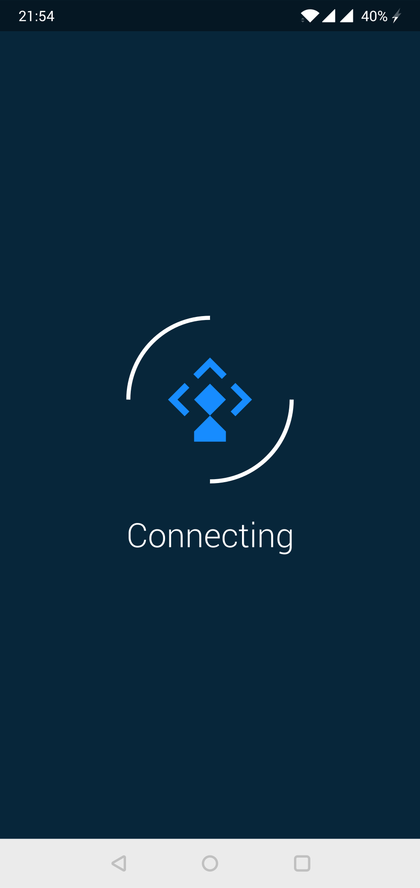
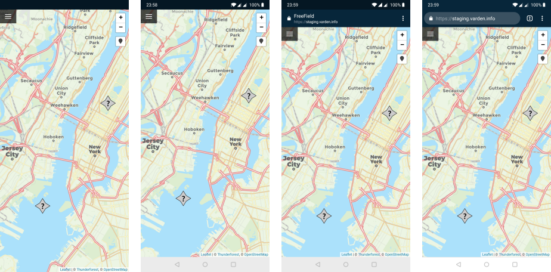
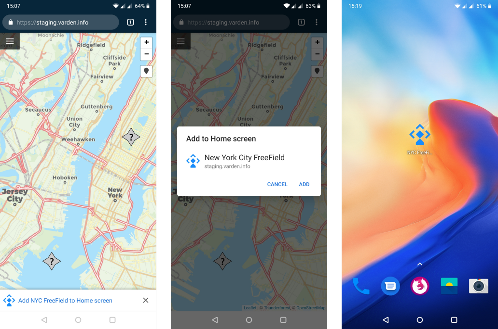
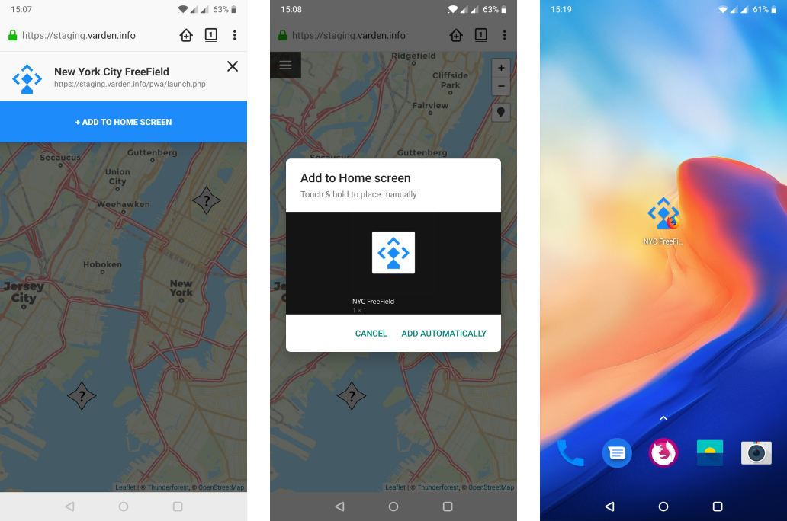

Progressive Web Apps (PWA)
==========================

FreeField has built-in support for the Progressive Web Apps standard. When PWA
is enabled in your FreeField installation, community members who browse your
site will be given an option to add FreeField to their home screens as a
shortcut. In practice, this makes it much easier to for your users to find
FreeField and report research quickly, rather than having to navigate to the
website URL every time.

PWA support is disabled by default, but you can enable it from the "Mobile"
section of the administration pages.

.. warning:: Once you've enabled PWA functionality, it can be very difficult to
             apply changes to the PWA settings later. Most clients typically
             cache the launch screen for a long time, and invalidating this
             cache can be difficult. This means that you should not enable PWA
             until you have made a final decision on the icon, color scheme,
             etc. of your app. See `Configuration`_ for more details.

How it works
------------

When a user installs the PWA app on their device (see `Installation preview`_),
a shortcut is created on the home screen of the user's device. This shortcut
contains a downloaded loading page for FreeField. When the shortcut is opened, a
loading page is displayed. The loading page has the word "Connecting" underneath
the FreeField logo in a spinning loading icon (see the preview below). This is
the "launch screen" of the PWA, and will open even if the device is offline.

   |br| The loading screen that is shown when the PWA app is opened. This screen will
   persist until the app has confirmed the user is online and able to connect to
   your FreeField instance.

.. |br| raw:: html

    

The purpose of the loading page is to check whether or not the device has an
Internet connection. It checks whether or not the device is reported online, and
if not, waits for it to go online. Once the online status has been confirmed,
the loading page will attempt to actually connect to FreeField. If it still
cannot connect (for example, the server could be down, a firewall could be
blocking the connection, or the device could be connected to a Wi-Fi network
with a captive portal for authentication), it will try again at intervals of
three seconds. As soon as the loading page gets a positive response from your
FreeField instance that it can be reached, the user is redirected to the map
page itself.

This connection checking might take a second or two to complete in many cases,
but the user experience improvement of not being presented user-unfriendly error
messages, plus automatic reconnection attempts in case of failure, will in most
cases greatly outweigh this minor delay. The loader will check for a connection
immediately upon launch, meaning in most cases, the loading screen is displayed
for less than a second.

After the loading page has been displayed, the user will be brought to the main
page of FreeField, i.e. the map. Viewing the map in the PWA app (and interacting
with FreeField in general) is functionally the same as using FreeField in a web
browser. However, the app can be configured to hide the browser address bar and
even navigation buttons (see `Configuration`_), giving users the impression that
they have installed FreeField as a stand-alone app. Users can also find and
launch FreeField from the application launcher of their device.

Configuration
-------------

The appearance of your PWA app can be freely customized. The following settings
are available for PWA apps - you can find these settings in the "Mobile" section
of the administration pages.

Enable PWA
^^^^^^^^^^

   This checkbox turns PWA on and off. Once this box is checked, PWA setup
   prompts will appear in the browsers of your users' devices when they next
   visit your site.

   .. note:: Existing PWA installations will continue to work if you disable
             this setting, though users will not be able to reinstall the app if
             they delete it from their device.

   .. caution:: Once you enable PWA, it will be difficult to change the other
                settings listed here, as most browsers cache the PWA setup
                permanently. For this reason, PWA is disabled by default. Please
                do not enable PWA until you have read through the behavior of
                all settings on this page, and are absolutely certain about your
                choice of PWA icons and colors.

Name
^^^^

   The name of the PWA application is a name that represents your PWA app. There
   are generally no length restrictions on this name.

   .. tip:: You should choose a name that reflects the community you have set up
            FreeField for. A good idea is to use the name of your community, or
            a location-specific name such as "New York FreeField."

   .. note:: If you change this setting, it is only applied to new installations
             of the PWA app. Existing PWA users must uninstall the shortcut from
             their device and re-add the shortcut for this change to take
             effect.

Short name
^^^^^^^^^^

   A short version of the name you specified earlier. This is the string that is
   displayed underneath the launcher icon on the device's app launcher and home
   screen.

   .. important:: The name you choose here should be short, so it is not cut off
                  (see e.g. the example screenshots in the `Installation
                  preview`_ section below, where "NYC FreeField" was cut off and
                  displayed as "NYC FreeFi..."). Aim for 10 characters or less
                  to avoid text overflow.

                  Do not use the default "FreeField" string here! If a user is a
                  member of several communities that use FreeField, and both of
                  them use the same name and icon, they will be displayed
                  identically, making it extremely difficult to tell them apart.

   .. note:: If you change this setting, it is only applied to new installations
             of the PWA app. Existing PWA users must uninstall the shortcut from
             their device and re-add the shortcut for this change to take
             effect.

Description
^^^^^^^^^^^

   A string that explains what the application is used for. You can set this to
   any description you wish, though keeping the default setting works just as
   well.

   .. note:: If you change this setting, it is only applied to new installations
             of the PWA app. Existing PWA users must uninstall the shortcut from
             their device and re-add the shortcut for this change to take
             effect.

Display mode
^^^^^^^^^^^^

   PWAs in FreeField support four different display modes:

   Fullscreen
      The app is displayed completely full-screen. Devices which have on-screen
      navigation buttons will hide those, and the bar at the top of the screen
      that displays time, battery status etc. will be hidden.

      .. warning:: Selecting this display mode will negatively affect the
                   usability of your site, especially for devices with on-screen
                   navigation buttons. It is therefore strongly recommended that
                   you do not choose this display mode.

   Standalone application
      The app will appear and function as if it was a standalone app on the
      user's device. Basic navigation controls will be displayed for devices
      which have on-screen navigation buttons. The address bar of the browser
      will be hidden.

   Standalone application with browser navigation controls
      The appears as if it was a standalone app, but more closely resembles a
      browser in that it may e.g. display the page URL and title and more
      browser navigation controls, such as a reload button. Users are not able
      to edit the URL in the address bar.

   Conventional browser window
      The app acts a shortcut only, which simply opens the standard web browser.
      Users will be able to use the browser interface as usual.

   .. note:: If you change this setting, it is only applied to new installations
             of the PWA app. Existing PWA users must uninstall the shortcut from
             their device and re-add the shortcut for this change to take
             effect.

   Below is a side-by-side preview of the four different display modes, in the
   order they were presented above.

App icons
^^^^^^^^^

   FreeField PWA apps use three different sizes or types of icons:

   192px and 512px icons
      These icons are the small and big icons for your PWA app. Generally, the
      small icon (192px) is displayed as the icon for your app on user's home
      screens. You should use the same image for both of these icons, at their
      respective resolutions.

      .. attention:: You are responsible for ensuring the icons you set are the
                     correct resolution. The 192px icon should measure 192x192
                     pixels, while the 512px icon should have dimensions of
                     512x512.

      .. note:: If you change this setting, it is only applied to new
                installations of the PWA app. Existing PWA users must uninstall
                the shortcut from their device and re-add the shortcut for this
                change to take effect.

   Loading screen icon
      This icon is used as the icon displayed inside the loading spinner on the
      loading page for the app. A preview of the loading page with the default
      loading icon ``default-pwa-launch.svg`` is displayed in the `How it
      works`_ section above. If you replace this icon, the icon would appear
      where the FreeField logo appears in that preview.

      .. caution:: This setting is cached in browsers. If you change this
                   setting, it will not be applied for any devices that have at
                   any point visited the FreeField site since PWA was enabled,
                   *even if they reinstall the PWA app*. As such, ensure that
                   you have made a final choice about the icon that you want to
                   use before you enable PWA.

Background color
^^^^^^^^^^^^^^^^

   The background color you choose for PWA apps are used in two places. When the
   PWA app starts in some browsers, an interstitial screen is displayed, showing
   the full name and icon of the app. The background of this interstitial page,
   along with the background of the loading screen, will assume the color used
   here.

   A preview of the loading page with the default dark blue background, r=8,
   g=38, b=58, is displayed in the `How it works`_ section of this page.

   .. caution:: This setting is partially cached in browsers. If you change this
                setting, it will not be applied **on the loading screen** for
                any devices that have at any point visited the FreeField site
                since PWA was enabled, *even if they reinstall the PWA app*.

                However, the background color used **on the interstitial page**,
                if applicable, will be updated if the user uninstalls and
                reinstalls the app.

                As such, ensure that you have made a final choice about the
                color that you want to use before you enable PWA.

Foreground color
^^^^^^^^^^^^^^^^

   The foreground color you choose for PWA apps are used on the loading page.
   The color is applied to the "Connecting" string, as well as the spinning
   quarter circles around the loading screen icon. A preview is displayed in the
   `How it works`_ section of this page.

   .. caution:: This setting is cached in browsers. If you change this setting,
                it will not be applied for any devices that have at any point
                visited the FreeField site since PWA was enabled, *even if they
                reinstall the PWA app*. As such, ensure that you have made a
                final choice about the color that you want to use before you
                enable PWA.

Installation preview
--------------------

The installation steps for PWA apps for end users is different for each browser.
The following previews show the process for Chrome and Firefox on Android.

Chrome installation process
^^^^^^^^^^^^^^^^^^^^^^^^^^^

When users visit your PWA-enabled website, they will be prompted to add a
shortcut to their home screen through a banner at the bottom of the page. The
name of the shortcut will be the short name you set in your configuration. If
the user acknowledges the prompt, a popup will open, displaying the full name of
the app, and prompting for confirmation that the user wants to add the shortcut.
If the user accepts, a shortcut will be created, and after a few seconds, it is
added in the first available slot on the user's home screen.

When the user opens the shortcut, the icon of the app will briefly be displayed
along with its full name before the loading page is displayed. When the loader
has verified that the user has an Internet connection, the user is redirected to
the map, where they can view and submit research tasks.

Firefox installation process
^^^^^^^^^^^^^^^^^^^^^^^^^^^^

When users visit your PWA-enabled website, there will be a house-like icon in
the address bar that the user can tap on to add the icon to their home screens.
Tapping this icon will display a banner at the top of the page showing the full
name of your app, with an :guilabel:`+ Add to home screen` button. When the user
taps this button, they will be prompted to drag the FreeField icon to their home
screens. Users can also have Firefox automatically position the icon on their
home screens.

When the user opens the shortcut, the loading page opens. When the loader has
verified that the user has an Internet connection, the user is redirected to the
map, where they can view and submit research tasks.

