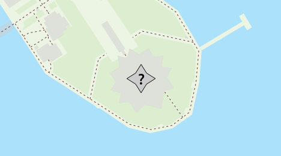
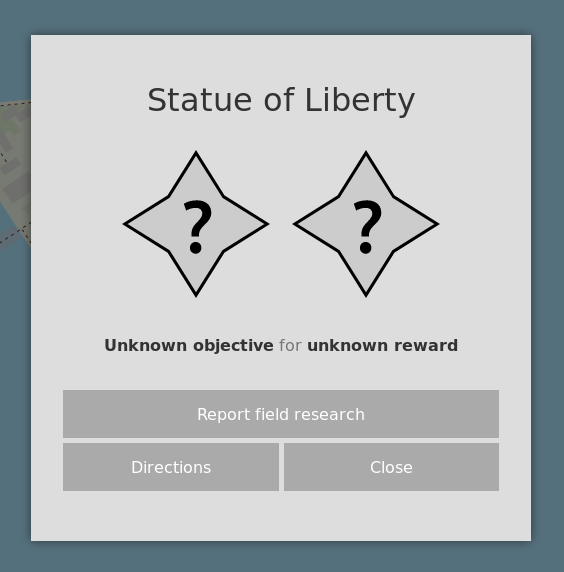
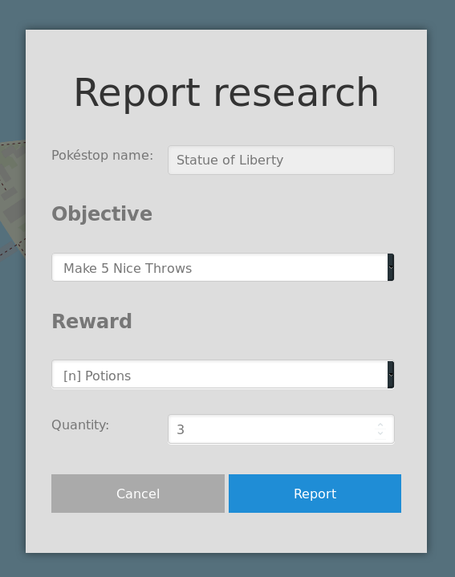
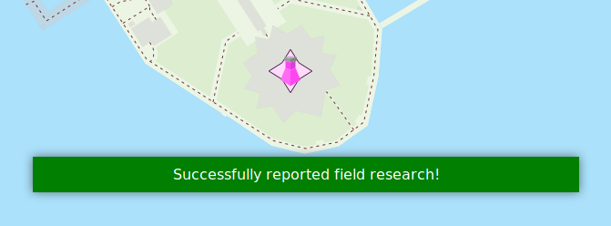
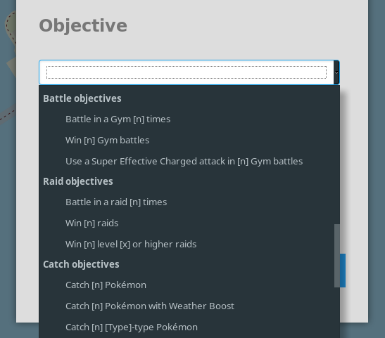
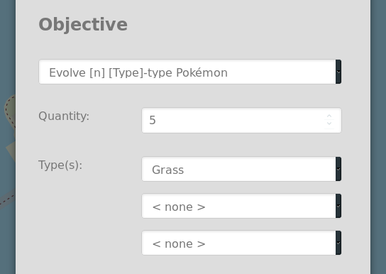

Reporting field research
========================

Reporting field research in FreeField is easy. When you report submit a report,
the research task will be displayed on the map, allowing anyone to easily find
tasks of interest. Administrators can also set up research alerts, automatically
alerting other members in your community about interesting research tasks in
your area.

Submitting a report
-------------------

1. Find the Pokéstop that you wish to report field research for on the map.

.. tip:: You can click on the geolocation button |locate-leaflet| or
         |locate-mapboxgl| to pan the map to your current location, letting you
         quickly locate Pokéstops near you.

         .. |locate-leaflet| image:: /_icons/locate-leaflet.png
            :align: middle

         .. |locate-mapboxgl| image:: /_icons/locate-mapboxgl.png
            :align: middle

2. Tap or click on the Pokéstop to open the Pokéstop details window. Click
   :guilabel:`Report field research`.

3. Select the research objective and associated reward. For example, to report
   the "Make 5 Nice Throws" objective with 3 Potions as the reward, the
   following can be entered. If the research objective you want to report is not
   listed, please see `Reporting unlisted research objectives`_ below.

4. Click on :guilabel:`Report`. A confirmation banner should appear, and the map
   marker will be updated to reflect the new research task.

The next time someone clicks on the Pokéstop, the research task you just
reported will be displayed. Research tasks are automatically reset at midnight.

Reporting unlisted research objectives
--------------------------------------

Sometimes, particularly after research task rotations, the research objective
you want to report is not listed in the "Current objectives" section at the top
of the list of reportable objectives. You can still report the research task,
but you'll have to fill in more details about the research objective manually.

In the list of research objectives, scroll down until you find the generic
research objectives:

Select the research objective that matches the objective that you want to
report. The objectives are grouped into categories, such as "Battle objectives,"
"Catch objectives," "Throwing skill objectives," etc. Next, fill in the listed
parameters. For example, to report the "Evolve 5 Grass-type Pokémon," the
following can be entered:

Next, fill in the reward as usual and submit the report by clicking
:guilabel:`Report`.
