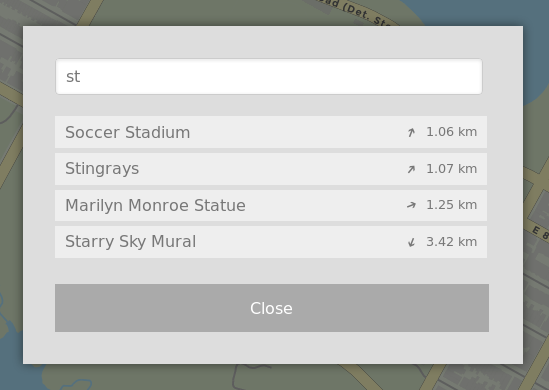

Searching for Pokéstops
=======================

FreeField has a search function for finding Pokéstops on the map by name.
Clicking on "Search" in the sidebar will open a search dialog where you can
enter the full or partial name of any Pokéstop on the map. As you type, the list
will update to show the best matches for your query.

The results list will show up to 10 Pokéstops, sorted by their relative distance
to you. Each result will show the name of the Pokéstop, along with its distance
and direction from your location. Clicking on any result will pan the map to the
location of that Pokéstop.

.. hint:: Search requires the geolocation permission and a location fix in order
          to show results near you. Your browser may warn you and ask for
          permission to perform geolocation, which must be granted for this to
          work properly.

          If FreeField cannot determine your location, search results will be
          sorted in descending alphabetical order, and show Pokéstop coordinates
          rather than their distances and directions.

          .. image:: _images/search-02-allow-geolocate.png
