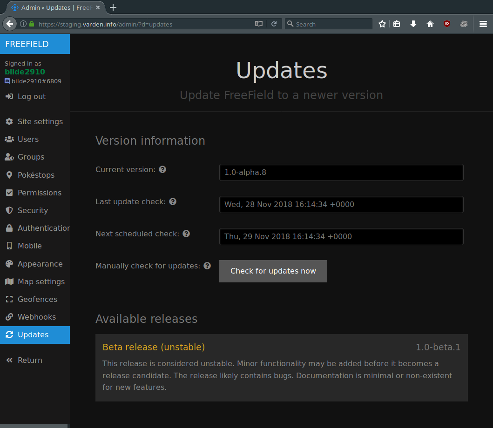
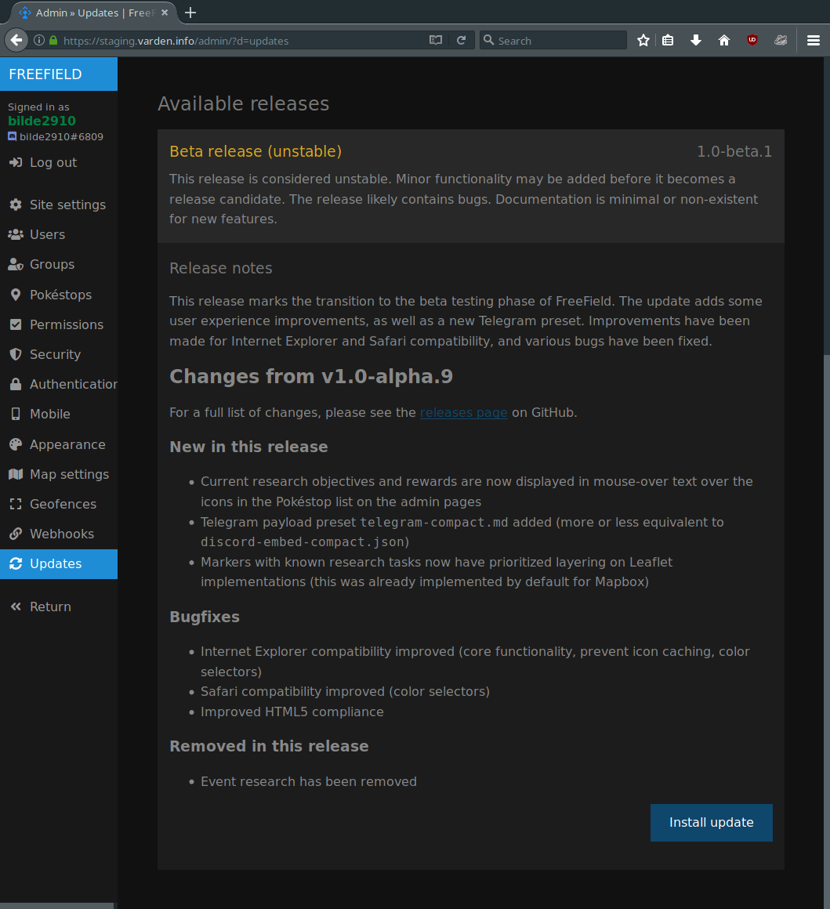
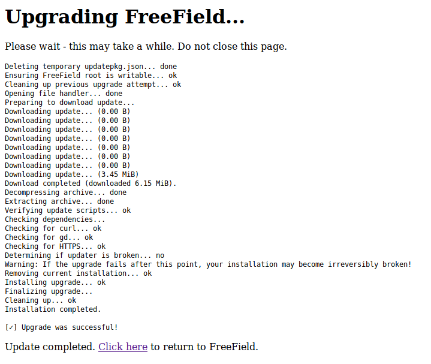

Installing updates
==================

The FreeField developers periodically release updates that improve the
performance or add new features to FreeField. It is recommended that you always
install stable updates when released. If you have installed FreeField using
releases from GitHub, updates can be installed from the updates section of the
administration interface. If you installed FreeField using ``git clone``, you
must update using ``git pull`` instead.

The updates section on the administration lists the current version, and any
currently available versions, offering you to install them.

Update branches
---------------

FreeField offers several release branches that can be chosen when updating,
ranging from alpha to stable. The alpha release will often contain the latest
bleeding-edge releases very soon after they are added to the codebase, but may
have significant bugs and can break unexpectedly. Once an alpha release reaches
feature parity for its corresponding version milestone, it is pushed to beta.
New beta releases will only contain minor updates and bugfixes. When beta
versions are deemed stable for production use, they are pushed to the release
candidate (rc) channel, and documentation will be written. Once documentation
has been written, and any remaining reported bugs are fixed, the update is
considered complete, and is pushed to the stable channel, prompting update
alerts in all FreeField installations.

Minor updates may skip one or more release channels. Updates to the field
research list, for example, are generally pushed directly to the stable branch,
given their extremely small likelihood to cause issues, and time-sensitive
nature of publication.

Most users are recommended to use the release candidate (rc) or stable branches
for production usage. Administrators who wish to try out new features quickly
may opt to use beta or even alpha release channels, offering new features
sooner, at the cost of reduced stability.

Installing an update
--------------------

Navigate to the updates section of the administration pages and click on
:guilabel:`Check for updates now` to check for new updates. If an update is
found, its release channel will be displayed in a list on that page. Click on
your desired release to find changelogs for the update and a button to install
the update.

.. caution:: The FreeField developers cannot guarantee the stability of any
             updates or the update process itself. If you proceed with the
             installation of any updates, including updates considered stable,
             you do so at your own risk and responsibility.

.. attention:: Read the changelog carefully before installing updates. Updates
               may contain breaking changes, and changelogs contain important
               information that may affect the way you use FreeField.

A window will pop up, asking you to confirm installation of the update. If you
accept and initiate the update, FreeField will download and install the update
automatically.

.. danger:: Once you have initiated an update, do not close the browser window
            until the installation is complete and you are told by the updater
            that it is safe to exit. **Failure to do so may result in corruption
            of your FreeField installation.**

A successful update will look like this (the exact steps displayed may vary):

Troubleshooting
---------------

Installation of updates is a sensitive process, and errors have the potential to
break your installation. Update failures can be classified into two categories.

Non-fatal errors
^^^^^^^^^^^^^^^^

.. compound::

   If the following warning message **does not appear** in the update log::

      Warning: If the upgrade fails after this point, your installation may become irreversibly broken!

   then the updater script has experienced a **non-fatal error**, and your
   installation has not been changed in any way. You can try to simply
   re-install the update and see if the cause was intermittent. If it still does
   not work, you can try waiting for a while before redoing the update.
   Alternatively:

-  Read the update log in the browser to determine if any checks fail, and fix
   the corresponding issues before retrying the update.

-  Click on :guilabel:`Check for new updates` before retrying. FreeField caches
   the list of available updates, and if an updated release has been pulled from
   the repository for stability reasons, and FreeField uses a cached download
   link for this update that thus no longer works, the updater will not find the
   release file, causing the update to fail.

-  Check that your server's firewall allows outbound connections. FreeField
   connects to api.github.com over HTTPS (port 443/tcp) to check for and
   download update packages.

-  Search for issues on the issue tracker on GitHub, or create a new one,
   pasting the output of the update log in the issue to seek further help.

Fatal errors
^^^^^^^^^^^^

.. compound::

   If the following warning message **appears** in the update log::

      Warning: If the upgrade fails after this point, your installation may become irreversibly broken!

   and the installation has **failed**, then the updater script has experienced
   a **fatal error**, and your installation may be corrupted. You will likely
   have to reinstall FreeField. Please thoroughly check whether your FreeField
   installation works before proceeding with the instructions below.

.. danger:: This is a disaster recovery procedure. If you follow the below
            instructions, please note that you do so **at your own risk** and
            that the FreeField developers are **not to be held responsible** for
            any damage caused to your system as a result of following these
            steps.

            A basic understanding of your server's operating system is required.
            Do not execute any commands listed here unless you are fully aware
            of their effects and accept any risk associated with executing them.

First, take a backup of your entire FreeField installation, using e.g.

.. code-block:: bash

   user@host:/var/www/html$ tar czvpf /tmp/freefield-backup.tgz *

Then, remove all files and directories in the FreeField installation directory,
except for the ``includes`` directory. Within ``includes``, delete all files and
directories except ``userdata``. Download the latest version of FreeField and
extract it on top of the old installation directory. When complete, your
installation should contain an includes/userdata directory with configuration
files already present. Attempt to access the FreeField installation again; it
should now be in a working state.

If the installation does not work, clear the installation directory completely
and restore the backup, using e.g.

.. code-block:: bash

   root@host:/var/www/html# rm -rf *
   root@host:/var/www/html# tar xzvf /tmp/freefield-backup.tgz .

Remove the same files as above, then download and install the version of
FreeField you were updating from (not the latest version) in the same way as
above.
