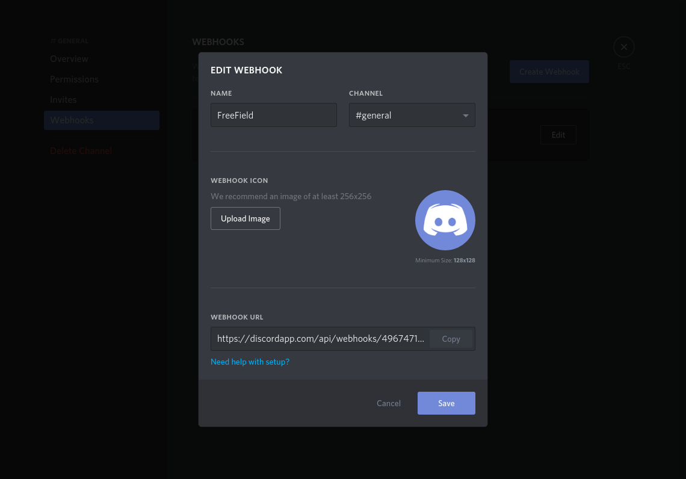
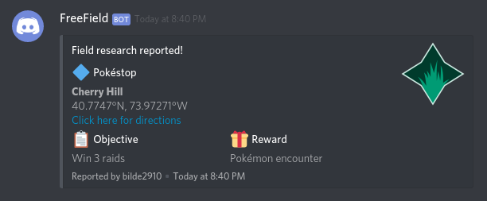

Discord webhooks
================

This guide will help you set up Discord webhooks in FreeField.

.. important:: You need the "Manage Webhooks" permission within the target
               Discord server in order to create webhooks on Discord.

.. note:: This page assumes you have read the general documentation on setting
          up webhooks, located on the :doc:`/webhooks/index` page. Discord also
          has specific documentation on webhook setup for end users in their
          `help center
          <https://support.discordapp.com/hc/en-us/articles/228383668>`_. The
          FreeField documentation on Discord webhooks builds upon this article.

Creating a webhook in Discord
-----------------------------

1. Open Discord and find the channel that you wish for FreeField alerts to be
   posted in.
2. Open channel settings for the channel by clicking on  next to the channel
   name in the channels list.
3. In the "Webhooks" section in the dialog that appears, click on
   :guilabel:`Create Webhook`.
4. Give your webhook a name and optionally an avatar. The name of your webhook
   is what would normally appear as the username when a person talks in your
   Discord server.

5. Copy the webhook URL at the bottom of the webhook dialog, then click
   :guilabel:`Save`.

Configuring the webhook on FreeField
------------------------------------

1. In the "Webhooks" section on the FreeField administration pages, click on
   :guilabel:`Add new webhook`.
2. Select "Post JSON" as the webhook type, and select an appropriate preset from
   the list of presets. Make sure you select a preset listed under `Supported
   presets`_. Click :guilabel:`Done` to create your webhook trigger.
3. In the "Webhook URL" field, paste the webhook URL you copied from Discord
   above.
4. Configure the webhook's settings and add filtering according to your own
   preferences.
5. Click on :guilabel:`Save settings` to save and activate your newly created
   webhook.

Payload syntax
^^^^^^^^^^^^^^

In order for Discord webhooks to function, the syntax of the payload has to be
valid. Please refer to Discord's `developer documentation on webhooks
<https://discordapp.com/developers/docs/resources/webhook>`_ for information
on constructing a valid payload.

.. warning:: If your payload does not have a valid structure, it will silently
             fail.

Supported presets
-----------------

The following presets are supported by FreeField's Discord webhooks:

discord.json
^^^^^^^^^^^^

