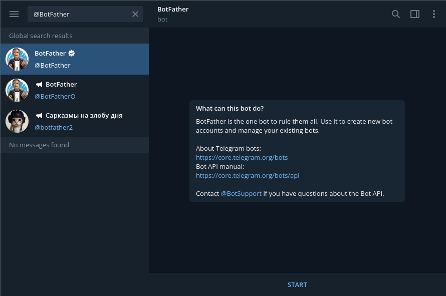
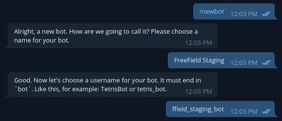
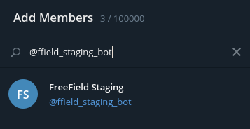
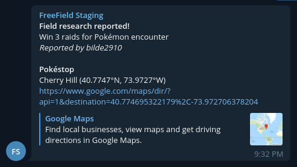

Telegram webhooks
=================

This guide will help you set up Telegram webhooks in FreeField. Creation of a
Telegram bot is required to set up message broadcasting in Telegram groups from
FreeField.

.. note:: This page assumes you have read the general documentation on setting
          up webhooks, located on the :doc:`/webhooks/index` page.

.. danger:: If you are using Telegram for authentication to FreeField, you
            should not re-use the same bot for webhooks. If your authentication
            bot's bot token is compromised, it could lead to account compromise
            as well as disruption, destruction, or full takeover of your
            FreeField installation. Create a separate bot for webhooks instead.
            See :doc:`/auth/telegram` docs for more information.

.. note:: Telegram webhooks can be slow, and may significantly increase the
          waiting time users experience when they submit a field research task
          that results in the webhook being triggered.

Creating a Telegram bot
-----------------------

A Telegram bot is required in order to set up message alerts in Telegram. To
create a bot, please do the following:

1. Search for the user ``@BotFather`` on Telegram and open a conversation with
   this bot, or `click here <https://t.me/BotFather>`_ to open a conversation
   directly. Click on the :guilabel:`Start` button at the bottom of the Telegram
   interface.

2. Issue the ``/newbot`` command in chat.

3. @BotFather will ask for a display name and username for your Telegram bot.
   Enter a display name and username. The display name can be anything, though
   the username must end with "bot".

4. You should now be assigned a bot token for your bot by @BotFather. Note this
   token down and keep it safe.

.. image:: _images/telegram-03-token.png

Add the bot to your group
-------------------------

In order for FreeField to send messages to your group, you need to add the bot
you just created to the Telegram group in which you want to receive field
research alerts.

1. Open your Telegram group. In the top right corner of the window, look for the
   vertical ellpisis menu symbol. Click on it to open the menu, and select "Add
   members."

2. Enter the username you defined for your bot above. Click on the bot when it
   appears in the list, then click :guilabel:`Invite`.

Configuring the webhook on FreeField
------------------------------------

1. In the "Webhooks" section on the FreeField administration pages, click on
   :guilabel:`Add new webhook`.

2. Select "Send Telegram message" as the webhook type, and optionally select a
   preset for the webhook payload. All of the listed presets are supported by
   the Telegram webhook type. You can see previews of each preset under
   `Supported presets`_. Click :guilabel:`Done` to create your webhook trigger.

3. In the "Bot token" field, enter the bot token you were assigned by @BotFather
   above.

4. In the "Webhook URL" dropdown box, pick "Select group."

5. FreeField will check which groups your bot has been added to. This might take
   a few seconds. When this is done, a popup will appear allowing you to select
   the group you want alerts sent to. Select your desired group, then click
   :guilabel:`Select`.

   .. note:: If you cannot find the desired group in the list of groups, or if
             you get an alert that no groups could be found at all, FreeField
             was unable to determine its membership in your Telegram group(s).
             The most common causes of this are that no messages were sent in
             the group since your bot joined, or that it has been a long time
             since the last message was sent.

             To fix this issue, issue the ``/my_id`` command in the Telegram
             group you would like to receive alerts in, then pick "Select group"
             again to re-search for group memberships.

6. Select the message format you would like to use when sending payloads to your
   Telegram chat. Telegram supports plain-text messages, as well as `messages
   formatted with Markdown and HTML
   <https://core.telegram.org/bots/api#formatting-options>`_.

7. Select whether or not you would like to disable link previews for messages
   sent by your webhook.

   .. tip:: This can be useful to reduce clutter in your Telegram group.

8. Select whether or not you want members to receive notifications for messages
   sent by your webhook.

   .. hint:: If you enable notifications, members of your group can still
             individually override this setting for your group by muting the
             group as a whole in their clients.

9. Configure the webhook's settings and add filtering according to your own
   preferences.

10. Click on :guilabel:`Save settings` to save and activate your newly created
    webhook.

Supported presets
-----------------

The following presets are supported by FreeField's Telegram webhooks:

telegram.md
^^^^^^^^^^^

